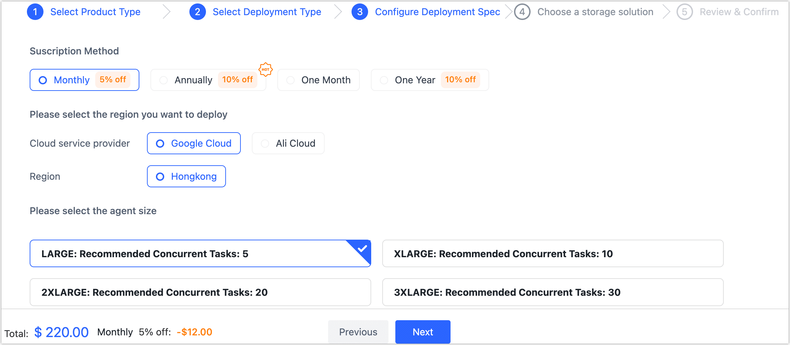

# Subscription Instance

After registering with Tapdata Cloud, you will receive the benefit of creating one free Agent instance. If you require additional agents or desire higher transfer performance, you can refer to the instructions in this article to complete the subscription process for the desired instance.

## Procedure

1. Log in to [Tapdata Cloud](https://cloud.tapdata.io/).

2. In the left bottom corner of the page, click **Resource Management**.

   After successfully creating a free Agent instance, if you find that your business requires additional Agent instances to meet performance needs, you can proceed with subscribing to more instances. This will allow you to scale up the capabilities of Tapdata Cloud to accommodate your business requirements effectively.

   

3. On the right side of the page, click **Create Agent**.

4. In the **Select Product Model** tab, select **Integration Platform as a Service** and click **Next**.

5. Select deployment type according your need and click **Next**.

   :::tip

   * **Fully-Managed Mode** (Recommend): Tapdata Cloud will provide the necessary computing/storage resources for running the Agent and deploys it automatically. It offers unified operational maintenance and resource monitoring to enhance operational reliability, enabling one-click delivery and usage, allowing your to focus on core business.
   * **Semi-Managed Mode**: You have the flexibility to [deploy the Agent](../quick-start/install-agent/README.md) on an existing device, leveraging the available hardware resources. This approach offers cost savings while enhancing security. 
   * 

   :::

6. Next, we will demonstrate the purchasing process using the **Fully-Managed Mode** as an example. First, select information such as Agent specification and subscription method.

   

   * **Subscription Period**: Select the required subscription method, in order to avoid the expiration of the instance affecting the execution of the task, it is recommended to choose the Annually (**10% off**) or Monthly (**5% off**).
   * **Select currency**: Currently supports CNY or USD.
   * **Region**: When selecting the Fully Managed Mode, you need to select a region where the Agent will depoly.
   * **Product specifications**: Select product specifications based on the number of tasks and performance requirements required for evaluation. You can create an example of **SMALL**(Semi-Managed Mode) specifications for free. For detailed descriptions of product pricing and specifications, see [Billing Overview](billing-overview.md).

7. Click **Next**, on the following page, carefully review and confirm the specifications you wish to purchase. Ensure that the selected billing method aligns with your preferences. Additionally, verify that the email address provided is accurate and where you would like to receive the bill. 

   Once you have double-checked all the information, click on the **OK** button to proceed with the purchase.

8. You will redirected to payment page. Please follow the instructions on the payment page to complete the payment process. After completing the payment, you will be able to download the payment credentials.

9. After the payment is successful, return to the Tapdata Cloud platform to see that the Agent instance you purchased is **To be deployed**.

   

   :::tip

   If you choose the Fully Managed Mode, the Agent will be automatically deployed. However, if you choose the Semi Managed Mode, you will need to manually [deploy the Agent](../quick-start/install-agent/README.md) on your own device.

   :::
