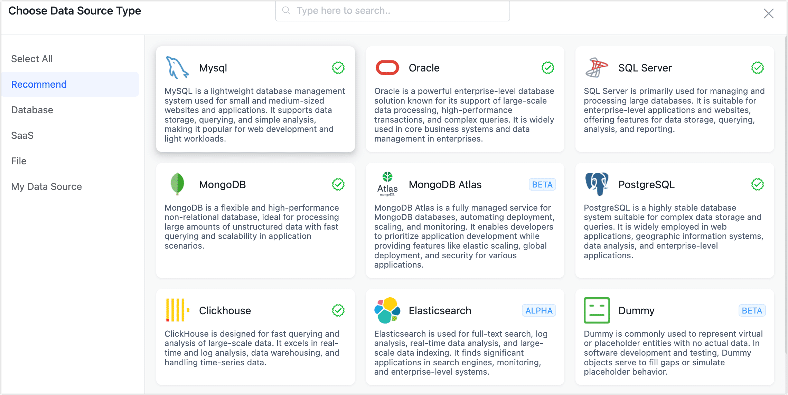

# Connect to Data Source

After completing the [deployment](install/README.md), you need to establish a connection to your database on the Tapdata platform. Once this is done, you can create data synchronization tasks.

## Procedure

1. Log in to the Tapdata platform.

2. Click **Connection Management** in the left navigation bar.

3. Click **Create Connection** on the right side of the page.

4. Select the database you want to add and fill in the connection information.

   

## Next Steps

[Create Data Synchronization Tasks](create-task.md)