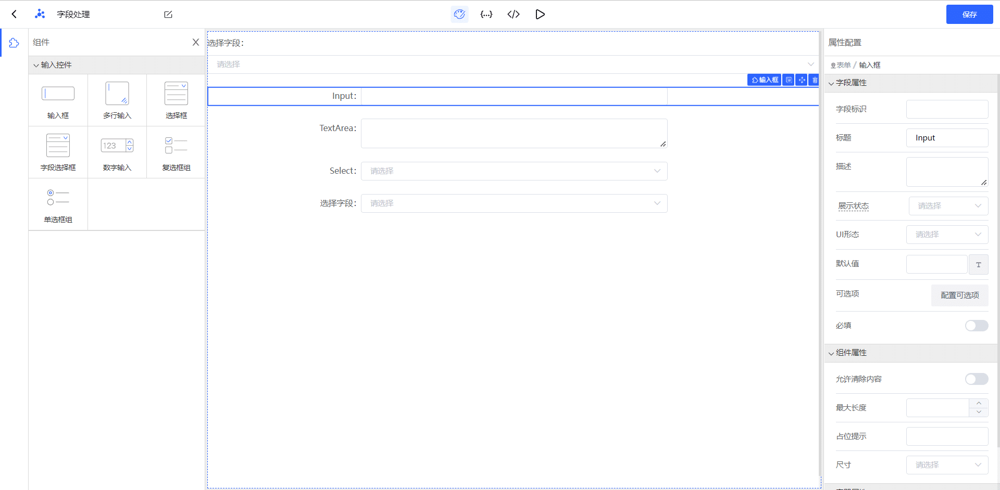
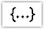
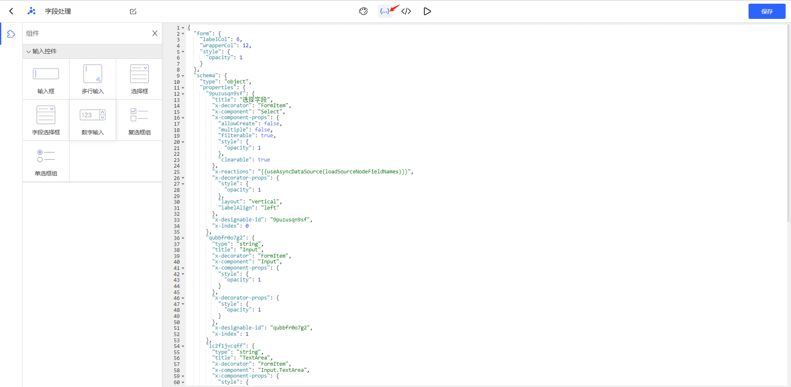
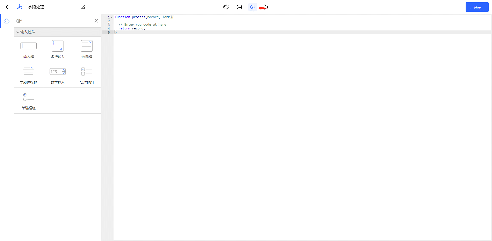
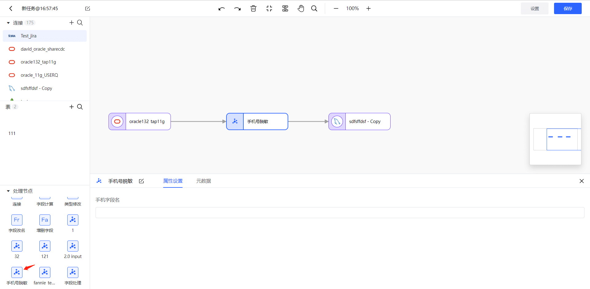
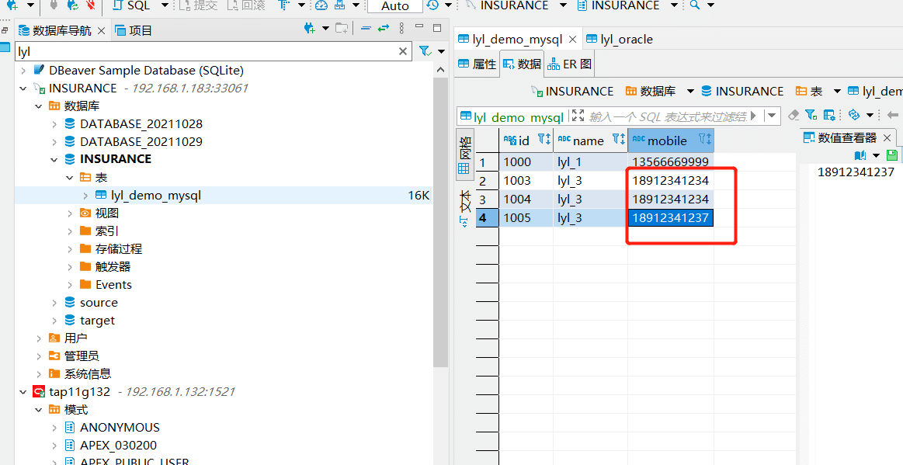
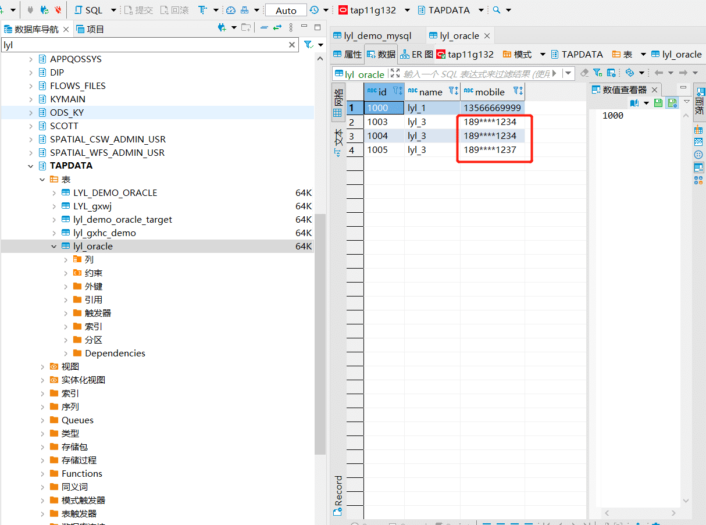

# Custom Nodes

Custom nodes allow you to package common JavaScript scripts into reusable processing nodes. Once created, these nodes can be directly used in data transformation tasks, eliminating the need to rewrite scripts and significantly reducing development workload. This document introduces the usage of custom nodes and provides related examples for reference.

## Creating Custom Nodes

1. Log in to the Tapdata platform.

2. In the left navigation bar, select **Data Pipeline** > **Custom Nodes**.

3. On the right side of the page, click **Add**.

4. On the redirected page, complete the settings as described below.

   1. Form components required for the processing node setup.

      

      - The left side is the component area, where you can drag and drop various needed components into the operation area and configure them.
      - The middle is the operation area, where you can adjust the position of each component or select them for configuration.
      - The right side is the configuration area, where you can set various configurations of the component (such as title, description, default value, etc.).

   2. Click the  icon at the top of the page to display the JSON model of the form items for the processing node. You can directly edit the form information on this interface.

      

   3. Click the  icon at the top of the page to edit the data processing logic of the processing node, where you can reference the field identifiers from the form.

      

   4. Click the  icon at the top of the page to preview the display effect of the node.

5. Click **Save** in the upper right corner of the page to complete the setup.

## Using Processing Nodes

Custom processing nodes created can be used in development tasks by dragging the needed nodes onto the DAG canvas for normal use.



## Example 1: Custom Data Masking Rules

For information security reasons, you may want to mask part of the phone numbers in a MySQL table. You can create a custom node with the appropriate configurations and logic, then create a development task and apply that node.

**Procedure:**

1. Log in to the Tapdata platform.

2. In the left navigation bar, select **Data Pipeline** > **Custom Nodes**.

3. On the right side of the page, click **Add**.

4. On the redirected page, follow the instructions below to complete the settings.

   - Node Name: Fill in the node name in the upper left corner of the page, for example, Phone Number Masking.
   - Action: Drag a single line input box from the left input control area to the middle operation area.
   - Field Identifier: Fill in the field identifier, such as masking_field_name.
   - Title: You can fill in any title, such as Phone Number Field Name.

     Other options are not mandatory.

5. Click the  icon at the top of the page to open the code editing interface and write the node logic.

    ```javascript
    // Code logic: Mask "1234" in the phone number
    function process(record, form){
      var pat=/(\d{3})\d*(\d{4})/;
      var b=str.replace(pat,'$1****$2');
      console.log(b)
      record[form.masking_field_name] = record[form.masking_field_name].replace("1234","****"); 
    }
    ```

6. Click the **Save** button in the upper right corner.

7. [Create a data transformation task](../data-pipeline/data-development/create-task.md), add the phone number masking node we just created between the source and target nodes, and fill in the corresponding field for the phone number, in this case, mobile.

   

8. Start the data transformation task to mask the phone numbers in the source table, as shown below:

   - Data in the source table:

     

   - After masking, data in the target table:

     

## Example 2: Custom CSV Field Processor

When synchronizing data to Redis with Tapdata, you might want to standardize the data in the format of a CSV file, such as escaping special characters for later data processing.

**Procedure:**

1. Log in to Tapdata platform.

2. In the left navigation bar, select **Data Pipeline** > **Custom Nodes**.

3. On the right side of the page, click **Add**.

4. On the redirected page, follow the instructions below to complete the settings.

   1. In the upper left corner of the page, fill in the node name, for example, CSV Escape.

   2. Drag a **Field Selector** from the left input control area to the middle operation area.

   3. In the component properties panel on the right side of the page, fill in the auto identifier (for example, fields) and then select **Multiple Selection**.

   4. Click the  icon at the top of the page to open the code editing interface and enter the following code. This function adds double quotes to each end of the field value and replaces internal double quotes with two double quotes to correctly represent data containing special characters in CSV files.

       ```javascript
       function process(record, form) {
         var tmp;
         var fields = form["fields"];
         if(fields) {
           for(var i in fields) {
             tmp = record[fields[i]];
             if(!tmp) continue;
             
             tmp = tmp.toString();
             record[fields[i]] = '"' + tmp.replaceAll("\"", "\"\"") + '"';
           }
         }
         return record;
       }
       ```

   5. Click the **Save** button in the upper right corner.

   6. [Create a data transformation task](../data-pipeline/data-development/create-task.md), add the CSV escape node we just created between the source and target nodes, then select the related fields.

      