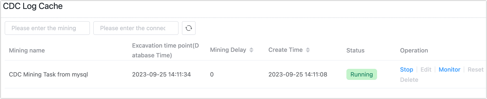
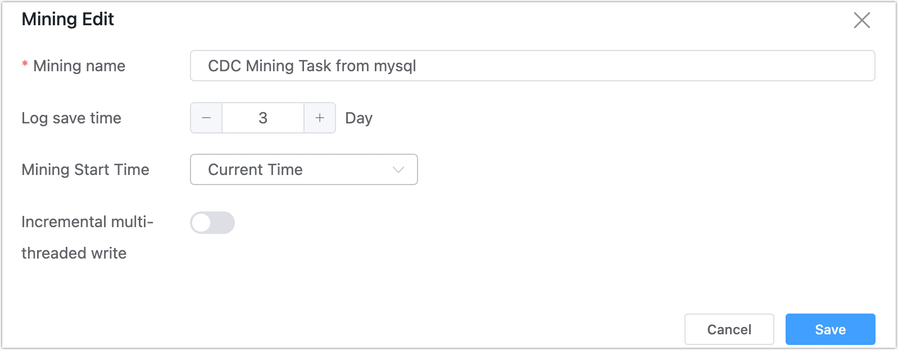
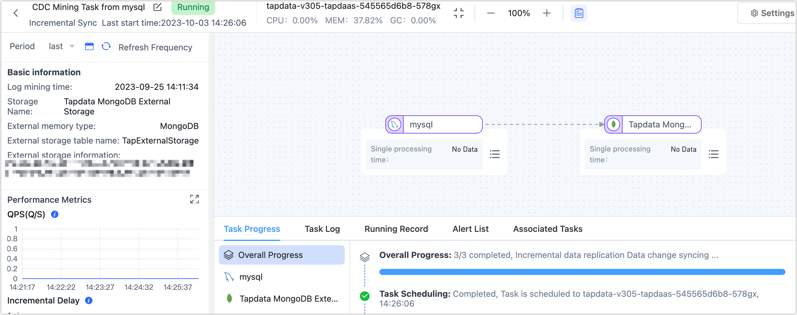
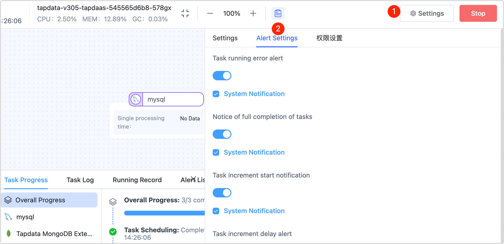
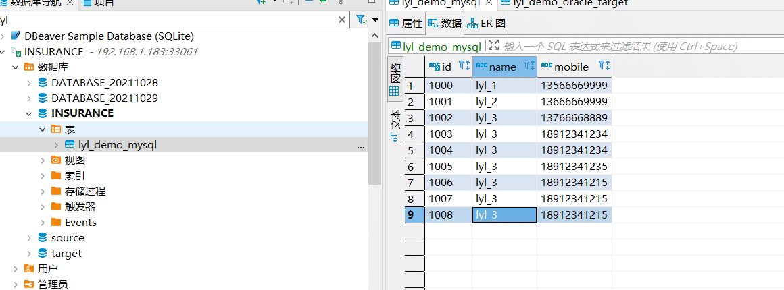
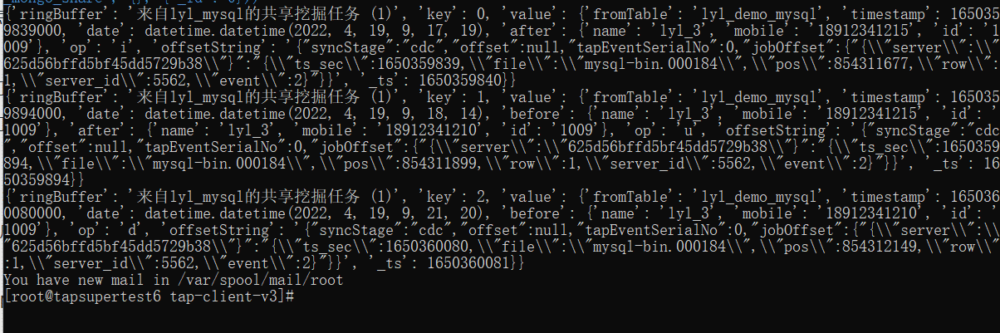
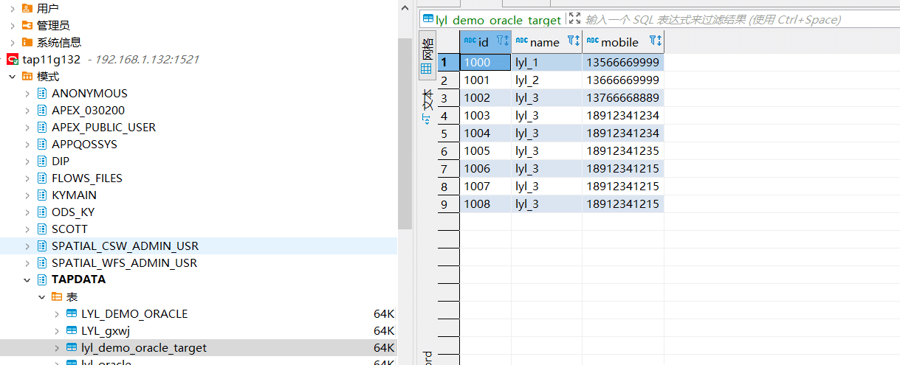

# Managing Shared Mining

To alleviate the pressure on the source database during incremental updates, Tapdata supports shared mining of incremental logs. The mining feature does not start immediately after activation but begins when you create tasks for tables under that data source. Both paused or errored mining tasks will not affect the normal operation of synchronization tasks.

## Enabling Shared Mining

You can enable shared mining when [creating a connection](../../quick-start/connect-database.md). Once enabled, data is read from the shared source. If this is the first time enabling it, you need to fill in the mining connection storage (a MongoDB can be chosen as the storage database).

## Using Shared Mining

Create data transformation or replication tasks. If the task includes incremental operations and the data source has shared mining enabled, you can use the shared mining feature in the task settings. For more about task configuration, see [creating data replication/development tasks](../../quick-start/create-task.md).

## Managing Shared Mining

After successfully creating the task, the system automatically generates a mining task. On the Tapdata platform, click **Data Pipeline** > **Shared Mining** in the left navigation bar. You will see the mining name prefixed with **the name of the data source** to help you identify it quickly:

Available management actions include:

- **Stopping shared mining tasks**: If you no longer need to run a shared mining task or need to adjust configurations, click **Stop**.
- **Editing shared mining configurations**: When a shared mining task is stopped, click **Edit**, then in the dialog that appears, set the mining name, log retention duration, mining start time, whether to enable multi-threaded incremental writes, and whether to supplement updated data with complete fields.

  

- **Monitoring task details**: Click **Monitor** corresponding to the mining task to view detailed mining information, such as QPS, incremental delay, and other key indicators.

  

- **Configuring task alerts**: Click **Monitor** corresponding to the mining task, then click settings in the top right corner. In the panel that appears on the right, configure task alerts to send out alert messages through system notifications or emails, helping you better grasp the running status of the task.

  

- **Starting and stopping specific table mining tasks**: Click **Monitor** corresponding to the mining task, then click the source node. In the panel that appears on the right, you can see the tables involved in shared mining, the number of mined entries, etc., as shown below.

  

  If a table causes an abnormal acquisition of incremental events due to a large transaction, you can select the relevant table on this page and click **Stop Mining**. After confirming the impact range in the dialog that appears, click **OK**.

  After completing the large transaction submission process, click the **Stopped Mining** tab, select the target table, and click **Resume Mining**.

## Use Case Scenario

Suppose you want to create a synchronization task from MySQL to Oracle but wish to reduce the source database's load through shared mining.

**Operational Approach:**

First, create a MongoDB as an intermediate database to store the mining logs. Then, enable shared mining for the connection that requires incremental log mining and select that MongoDB. Finally, enable shared mining when creating the task.

**Detailed Process:**

1. Create a database connection to store shared mining data.
    1. Open connection management and click the **Create Connection** button in the top right corner.
    2. Create a MongoDB connection with the following configuration:
        - Connection Name: Any name, e.g., lyl_mongo
        - Connection Type: Source and Target
        - Connection Mode: Standard Connection
        - Database Address: 47.115.163.**
        - Database Name: test
        - Other fields are not mandatory
    3. Click the **Save** button to return to the connection management interface.

2. Click the **Create Connection** button in the top right corner to create a MySQL connection as the source and enable shared mining.

3. Select the MongoDB connection you just created as the intermediate storage database (this step can also be performed in the shared mining - mining settings section). If setting it again, it won't show up for the second time.
    - Storage MongoDB Connection Name: lyl_mongo
    - Storage MongoDB Table Name: david_mongo_share

4. Click the **Save** button.

5. Create an Oracle connection as the target (no need to enable shared mining).

6. Open the data transformation page and click the **Create** button in the top right corner to create a task.
    1. Select the newly created MySQL connection as the source, table selection: lyl_demo_mysql.
    2. Select another connection as the target, table selection or creation: lyl_demo_oracle_target, and connect them.
    3. In the DAG canvas, click the **Settings** button in the top right corner.
    4. Turn on the **Shared Mining** button and then click the **Save** button in the top right corner.

7. Click the **Back** button in the top left corner to return to the task list page.

8. Click the **Start** button for the task. The system will automatically generate a shared mining task along with starting the task.

   You can view this mining task by clicking Data Pipeline - Shared Mining and clicking the **Details** button for more information.

**Demonstration:**

Add a new data entry in the source database:

Check the MongoDB intermediate database (to see if incremental logs are present):

python376 tap.py --source_type=MongoDB --name=lyl_mongo --table=david_mongo_share  common_query

Check the target database to see if incremental data is present:

