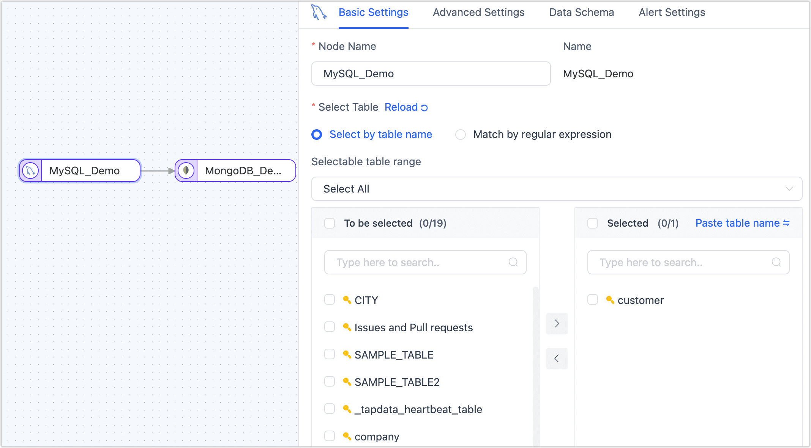
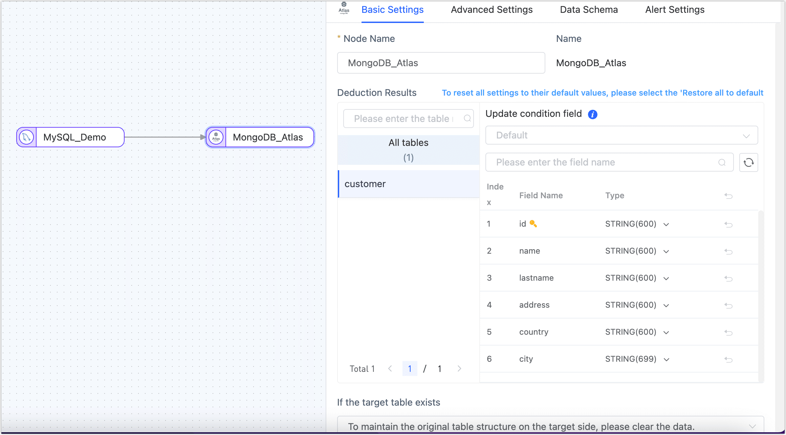

# Creating a Data Replication Task

The data replication feature can help you achieve real-time synchronization between the same or different types of data sources. It is suitable for various business scenarios such as data migration/synchronization, data disaster recovery, and read performance expansion. This article introduces the specific use process of the data replication feature to help you quickly learn how to create a data replication task.

## Procedure

This article takes the real-time synchronization from MySQL to MongoDB as an example, showing you the process of creating a data replication task. Other data sources can refer to this process.

1. Log in to the Tapdata platform.

2. In the left navigation bar, select **Data Pipeline** > **Data Replication**.

3. Click **Create** on the right side of the page, and navigate to the task configuration page.

4. Drag and drop the data connections that will act as the source and target to the right canvas, and then connect them.

5. Connect the source and target nodes.

   

   :::tip

   In addition to adding data source nodes, you can also add processing nodes to complete more complex tasks, such as filtering data, adding/reducing fields, etc. For more introduction, see [Processing Nodes](#process-node).

   :::

6. Click the source node (MySQL in this example), and complete the parameter configuration on the right panel according to the instructions below.

   

    * **Basic Settings**

        * **Node Name**: By default, it's the connection name, but you can also set a meaningful business name.
        * **Table**: Select the source table to operate. The table structure, including column names and types, will be displayed below.

    * **Advanced Settings**

        * **DDL Synchronization**      
          Choose whether to enable **DDL Event Collection**. When this switch is on, Tapdata will automatically collect the DDL events (like adding fields) from the selected source. If the target side supports DDL writing, the DDL statements can be synchronized.

        * **Incremental Method**      
          Choose **Log CDC** or **Polling**. If you select **Polling**, you'll also need to specify the polling field, interval, and number of rows read each time.

          **Log CDC** will use the data source's transaction log to parse and sync incremental events. **Polling** will sync incremental events by polling a field, but it often can't sync delete events.

        * **Data Filter**

            * **Fully Customizable Query**: Turn this on to input a custom SQL query for full data sync (doesn't affect the incremental stage). For example, `SELECT id,name,address FROM customer;`.
              :::tip
              To use this feature, the target node must be a weak Scheme type of data source (like MongoDB/Kafka) etc.
              :::
            * **Filter Settings**: Off by default. Turn it on to specify data filtering conditions.

        * **Batch Read Number**: For full data sync, the number of records read per batch. Default is **100**.

    * **Alert Setting**   
      By default, if the node's average processing time is continuously 5 seconds or more for 1 minute, a system and email notification will be sent. You can adjust the rules based on your business needs or turn off the alerts.

7. Click the target node (MongoDB in this example), and complete the parameter configuration on the right panel according to the instructions below.

   

    * **Basic Settings**
        * **Node Name**: Defaults to the connection name; you can also set a name that has business significance.
        * **Deduction Results**: Displays table structure information that Tapdata will write into the target, deduced from the source node setting. The update condition will be automatically set as the table's primary key, or if there isn’t one, a unique index field will be used.
        * **Duplication Handling Strategy**: Choose according to business needs; defaults to **To maintain the origina table structure on the target side, please clear the data**.
        * **Full Multi-thread Writing**: The number of concurrent threads for writing full data; default is **8**.
        * **Incremental Multi-thread Writing**: The number of concurrent threads for writing incremental data.
        * **Batch Write Item Quantity**: The number of items written per batch during full synchronization.
        * **Max Wait Time per Batch Write**: Set the maximum waiting time per batch write, evaluated based on the target database’s performance and network latency, in milliseconds.
    * **Advanced Settings**
        * **Data Writing Mode**: Select according to business needs.
            * **Process by Event Type**: If you choose this, you also need to select data writing strategies for insert, update, and delete events.
            * **Statistical Append Write**: Only processes insert events, discarding update and delete events.
        * **Data Source Exclusive Configuration**: Choose whether to save deleted data.
    * **Data Model**
      Displays table structure information of the target table, including field names and field types.
    * **Alert Settings**
      Defaults as per source node alert settings.

8. (Optional) Click **Settings** in the upper right corner of the page, and configure the **Task Attributes**.

    * **Task Name**: Enter a name that has business significance.
    * **Sync Type**: You can choose both full and incremental, or you can select either full or incremental separately. 'Full' means copying the existing data from the source to the target, while 'incremental' means copying new or changed data produced by the source in real-time. Combining the two can be used for real-time data synchronization scenarios.
    * **Advanced Settings**: Set the task's start time, incremental data processing mode, the number of processing threads, Agent, etc.

9. Click **Save** or **Start** to complete the creation. To ensure the task runs normally, Tapdata will pre-check based on node configurations and data source features, while printing log information.

   :::tip

   If the pre-check is not passed, please adjust according to the log tips on the current page. For more information, see [Task Pre-check Explanation](../pre-check.md).

   :::

10. After successful startup, it will automatically jump to the task monitoring page, where you can view detailed running status and task monitoring information.

    

## See also

By combining multiple processing nodes and multiple data sources, a more complex and personalized data flow can be achieved. For more information, see [Processing Nodes](../data-development/process-node.md).
