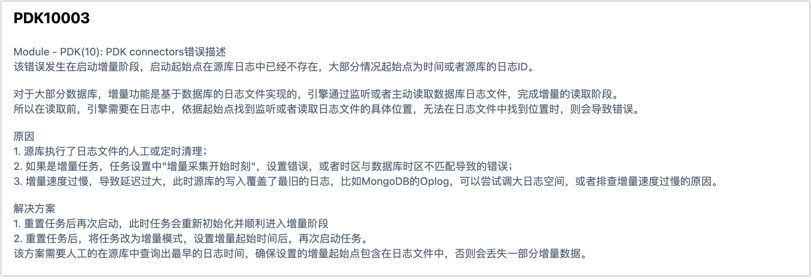

# Monitoring Data Replication Tasks

After a data replication task starts, the page automatically redirects to the task monitoring page, where you can observe the task's running details, including Agent status, data synchronization status, task progress, and alarm settings.

:::tip

You can also enter the monitoring page by clicking **Monitor** for the corresponding task on the task list page.

:::

## ① Top Control Bar

You can rename the task, view the task's start time, and check the Agent's status, which includes:

- CPU Usage: The percentage of CPU used by the engine process relative to the total system CPU.
- Memory Usage: Used heap memory / maximum heap memory.
- GC Throughput: (Total engine runtime - GC time) / Total engine runtime * 100%.

## ② Task Key Metrics Display Bar

Displays basic information and key monitoring indicators of the task, including synchronization information, task verification information, performance indicators, and task time statistics. Among them:

- Task Verification: Only displayed when verification is enabled for the task. If anomalies are found, you can click to view verification details.
- QPS: The average number of input and output events processed by the task per second, which can be viewed based on the dimension of event quantity or size.
- Incremental Latency: The delay from when an event is generated in the source to when it is processed by the task and written to the target, in milliseconds. When there are multiple targets, only the maximum incremental delay time is counted.
- Task Statistical Events: Accumulates all events after the task runs, with the following considerations:
  - Updates: If the insertion event output to the target is found to exist when inserted into the target database, and the write strategy is set to update when the target exists, then the insertion event will become an update event.
  - DDL:
    - Since Tapdata directly builds tables in the target based on inference results, DDL events output from the source are not counted, but DDL events for building tables can be counted at the target node.
    - If the target is a database type that does not require table creation (such as MongoDB), table creation events for the target will not be counted.
    - If the target's duplicate processing strategy is set to clear target structure and data, two DDL events, DROP TABLE and CREATE TABLE, will be counted.

## ③ Node Information Display Area

Hovering the cursor over a node displays key metrics information for the corresponding node. Clicking the  icon in the lower right corner of the node reveals more details.

- Full Progress: Displays the node's full progress during the full phase.
- Incremental Timestamp: Displays the timestamp of the incremental log collection during the incremental phase. The relative time (current engine time - the node's incremental timestamp) is used to express this, with specific incremental timestamp information shown in a popup when the mouse hovers over it.
- Write Time: The time taken to write data to the target.
- QPS: The QPS of the node.
- Cumulative Input Events: The number of events input to the node from the previous node or source.
- Cumulative Output Events: The number of events output from the node to the next node or target.
- Processing Time: The time taken for the node to process data.

## ④ Task Log Display Area

Clicking the  icon at the top of the page displays the task log area. Here, you can view the task's progress, logs, run records, alarm list, and related task information. In the **Logs** tab, you can filter logs by keywords, periods, and levels, and download logs for local analysis.

Furthermore, Tapdata also supports displaying related error codes for common issues.

Clicking on the error code opens a dialog box with detailed causes and solutions. For more information, see [Task Error Codes and Solutions](../../../troubleshooting/error-code.md).

## ⑤ Task/Alarm Settings Area

Clicking the  icon at the top of the page displays task settings (not modifiable) and alarm settings. You can set alarm rules for:

- Task Error Alarms
- Task Completion Notifications
- Task Incremental Start Notifications
- Task Stop Notifications
- Task Incremental Delay Alarms