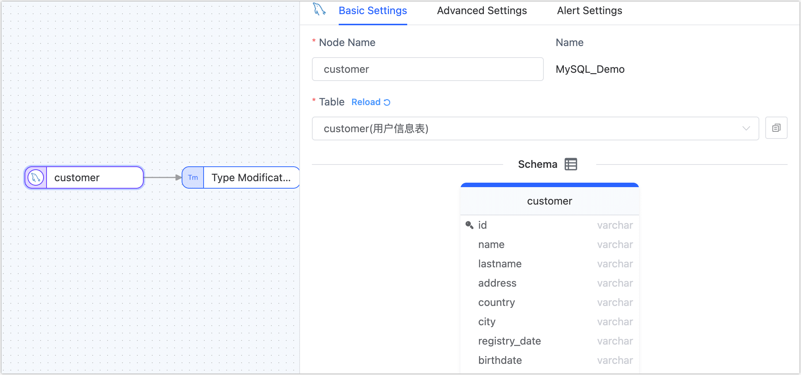
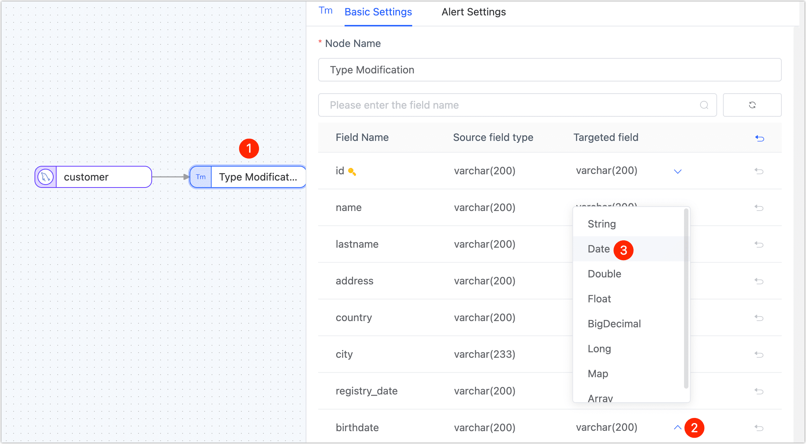
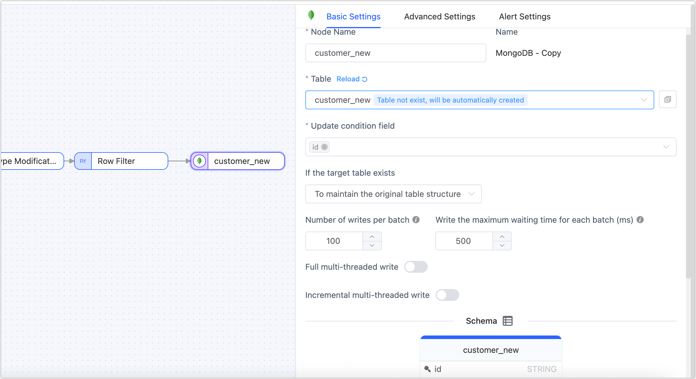

# Creating a Data Transformation Task

Tapdata's data transformation tasks support adding processing nodes between source/target nodes, helping you quickly realize various data processing requirements like merging multiple tables, data splitting, and field addition/reduction. This article introduces the creation process of data transformation tasks.

## Procedure

In this case, we will demonstrate how to convert the **birthdate** field type from **STRING** to **DATE** in the source table (**customer** table) without changing its structure and data through a data transformation task, filter users born after **1991-01-01**, and finally apply the table structure and filtered data to a new table (**customer_new**).

1. Log in to the Tapdata.

2. In the left navigation bar, select **Data Pipelines** > **Data Transforms**.

3. Click **Create** on the right side of the page, navigating to the task configuration page.

4. In the **Connection** section on the left side of the page, drag the data connections, which will be the source and target, onto the right canvas sequentially.

5. In the **Processing Nodes** section on the left, drag the **Type Modification** node and **Row Filter** node sequentially.

   :::tip

   For more introductions and application scenarios of processing nodes, see [Processing Nodes](process-node.md).

   :::

6. Connect the aforementioned four nodes in the order of data flow as shown below.

   

7. Follow the instructions below to configure each node in sequence.

    1. On the canvas, click the source node on the far left and complete the parameter configuration in the right panel according to the following instructions.
       

        * **Basic Settings**
            * **Node Name**: Defaults to the connection name, but you can set a name with business meaning.
            * **Table**: Select the source table to operate on. The table structure, including column names and column types, will be displayed below.

        * **Advanced Settings**
            * **DDL Sync Configuration**
              Choose whether to enable **DDL Event Collection**. Once this option is enabled, Tapdata will automatically collect the selected source DDL events (such as adding fields). If the target end supports DDL input, DDL statement synchronization can be achieved.

            * **Incremental Synchronization Method**
              Choose between **Log CDC** and **Polling**. If you select **Polling**, you need to specify the polling field, interval, and number of rows to be read each time.

              **Log CDC** will use the data source transaction logs for parsing and incrementally syncing events, while **Polling** incrementally syncs events by polling fields, typically unable to sync delete events.

            * **Data Filter**

                * **Fully Customizable Query**: Once this option is enabled, you can enter the SQL query statement to be executed during the full data synchronization stage (does not affect the incremental stage). This allows for custom data extraction (such as data filtering, Joins, etc.), for example, entering `SELECT id, name, address FROM customer;`.
                  :::tip
                  Enabling this feature requires the target node to be a weak Scheme type data source (such as MongoDB/Kafka), etc.
                  :::
                * **Filter Settings**: By default, it is off. When enabled, you need to specify the data filtering conditions.

            * **Batch Read Count**: During full synchronization, the number of records read in each batch. The default is **100**.

        * **Alert Settings**
          By default, if the node's average processing time is equal to or greater than 5 seconds for a consecutive minute, system and email notifications are sent. You can also adjust the rules or turn off alerts according to business needs.

    2. Click on the **Type Modification** node, and then in the right panel, modify the type of the **birthdate** field to **Date**.
       

    3. Click on the Row Filter node and complete the parameter configuration in the right panel according to the following instructions.

       

        * **Action**: Choose **Retain Matching Data**.
        * **Conditional Expression**: Enter the data matching expression, in this case `record.birthdate >= '1990-01-01'`, supported symbols are:
            * Comparison: greater than (`>`), less than (`<`), greater than or equal to (`>=`), less than or equal to (`<=`), equal to (`==`)
            * Logical Judgments: and (`&&`), or (`||`), not (`!`)
            * Regular Expression: e.g., `/^.*$/.test( )`
            * Conditional Grouping: If you need to add multiple condition groups, first enclose each group in parentheses, and then add logical judgment symbols between each group. For example, to filter males over 50 or people over 30 with an income under 10,000: `(record.gender == 0 && record.age > 50) || (record.age >= 30 && record.salary <= 10000)`

    4. Click the final target data node and complete the parameter configuration in the right panel according to the following instructions.

       

        * **Basic Settings**
            * **Node Name**: Defaults to the connection name, but you can set a name with business meaning.
            * **Table**: Select the table to write the processed data to. The table will be created automatically if it does not exist.
            * **Update Condition Field**: Select the field to be the basis for the update condition.
            * **Existing Data Handling**: Choose according to business needs. If the target table has no data and its structure is inconsistent with the source table, you can choose **Clear the Existing Structure and Data of the Target Table**.
            * **Batch Write Count**: The number of entries written per batch during full synchronization.
            * **Maximum Wait Time per Batch Write**: Set the maximum waiting time based on the target database’s performance and network latency, measured in milliseconds.
            * **Full Multi-Threaded Write**: The number of concurrent threads for writing full data. The default is **8**; adjust based on the target end's write performance.
            * **Incremental Multi-Threaded  Write**: The number of concurrent threads for writing incremental data. By default, it is not enabled. Enable and adjust based on the target end's write performance.
            * **Schema**: Displays the source table structure information, including field names and field types.
        * **Advanced Settings**
          Choose the data writing mode according to business needs:
            * **Handle by Event Type**: After selecting this option, you need to also choose the data writing strategy for insert, update, and delete events.
            * **Statistic Append Write**: Only handles insert events, discarding update and delete events.
        * **Alert Settings**
          By default, if the node's average processing time is equal to or greater than 5 seconds for a consecutive minute, system and email notifications are sent. You can also adjust the rules or turn off alerts according to business needs.

8. (Optional) Click **Settings** in the top right corner of the page to configure task properties.

    * **Task Name**: Enter a name with business meaning.

    * **Synchronization Type**: Choose **Full + Incremental**, or select **Full** or **Incremental** only.
      Full indicates that the stock data from the source end is copied to the target end, Incremental means that new data or data changes generated in real-time from the source end are copied to the target end. Combining the two can be used for real-time data synchronization scenarios.

    * **Task Description**: Enter a description of the task.

    * **Advanced Settings**: Set the task start time, [Shared Mining](../../advanced-settings/share-mining.md), incremental data processing mode, processor thread count, Agent, etc.

9. Click **Save** or **Start** to complete the creation. To ensure the task runs smoothly, Tapdata will perform a pre-check based on node configurations and data source characteristics while printing log information.

   :::tip

   If the pre-check is not passed, please adjust according to the log tips on the current page. For more information, see [Task Pre-check Explanation](../pre-check.md).

   :::

10. After successful start-up, it will automatically redirect to the task monitoring page, where you can view information such as the task's QPS, delay, and task events.

## Data Verification

Log into the target database and check the structure of the **customer_new** table; the type of the **birthdate** column is **datetime**. Next, check the number of users born before **1990-01-01**—the number should be zero. The total number of records in the table is **31276**, proving that this part of the data has been filtered out.

```sql
mysql> DESC customer_new;
+---------------+--------------+------+-----+---------+-------+
| Field         | Type         | Null | Key | Default | Extra |
+---------------+--------------+------+-----+---------+-------+
| id            | varchar(200) | NO   | PRI | NULL    |       |
| name          | varchar(200) | NO   |     | NULL    |       |
| lastname      | varchar(200) | NO   |     | NULL    |       |
| address       | varchar(200) | NO   |     | NULL    |       |
| country       | varchar(200) | NO   |     | NULL    |       |
| city          | varchar(200) | NO   |     | NULL    |       |
| registry_date | varchar(200) | NO   |     | NULL    |       |
| birthdate     | datetime(3)  | NO   |     | NULL    |       |
| email         | varchar(200) | NO   |     | NULL    |       |
| phone_number  | varchar(200) | NO   |     | NULL    |       |
| locale        | varchar(200) | NO   |     | NULL    |       |
+---------------+--------------+------+-----+---------+-------+
11 rows in set (0.00 sec)

mysql> SELECT COUNT(*) FROM customer_new WHERE birthdate < 1990-01-01;
+----------+
| count(*) |
+----------+
|        0 |
+----------+
1 row in set, 1 warning (0.01 sec)

mysql> SELECT COUNT(*) FROM customer_new
+----------+
| count(*) |
+----------+
|    31276 |
+----------+
1 row in set, 1 warning (0.01 sec)
```

## See also

Combining multiple processing nodes and data sources can achieve more complex and personalized data flow transformations. For more information, see [Processing Nodes](process-node.md).

