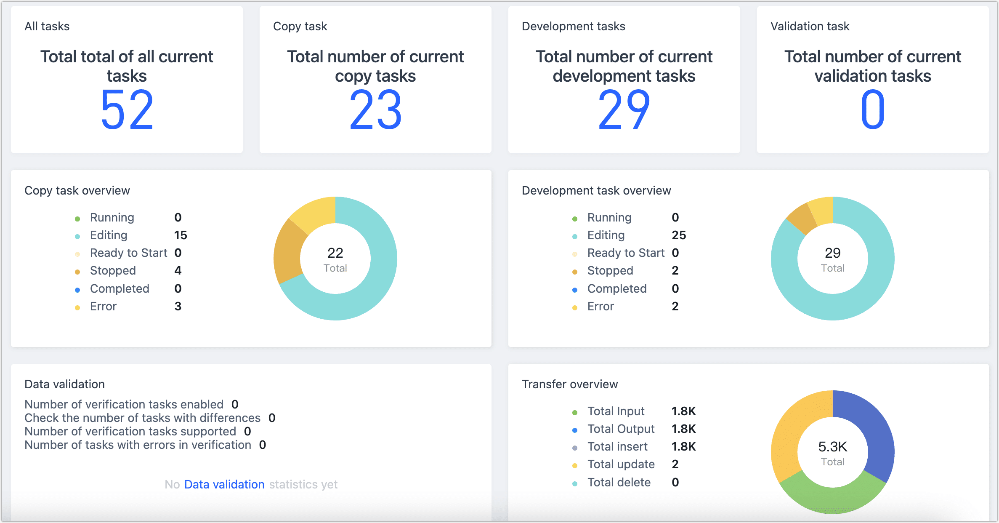

# Console Introduction

Upon logging into Tapdata, the console page is opened by default, where you can view a summary of all tasks within the system, including their quantity, status, and operational data statistics. It also provides an overview of the current status of the system's cluster.

The console page primarily includes the following key metrics:

**All Tasks**: Displays the total number of tasks for the current user, including data replication tasks, data transformation tasks, and data verification tasks.

**Replication Tasks**: Shows the total number of data replication tasks created by the current user.

**Transformation Tasks**: Indicates the total number of data transformation sub-tasks created by the current user.

**Verification Tasks**: Lists the total number of data verification tasks created by the current user.

**Replication Task Overview**: Presents the distribution of task statuses for all data replication tasks created by the current user.

**Transformation Task Overview**: Displays the status distribution of data transformation tasks created by the current user.

**Data Verification**: Shows the distribution of verification results for all data verification tasks created by the current user.

**Transfer Overview**: Provides statistics on event transmission for all data replication and transformation tasks created by the current user.

**Cluster Overview**: Offers a current status view of each service node within the system's cluster.