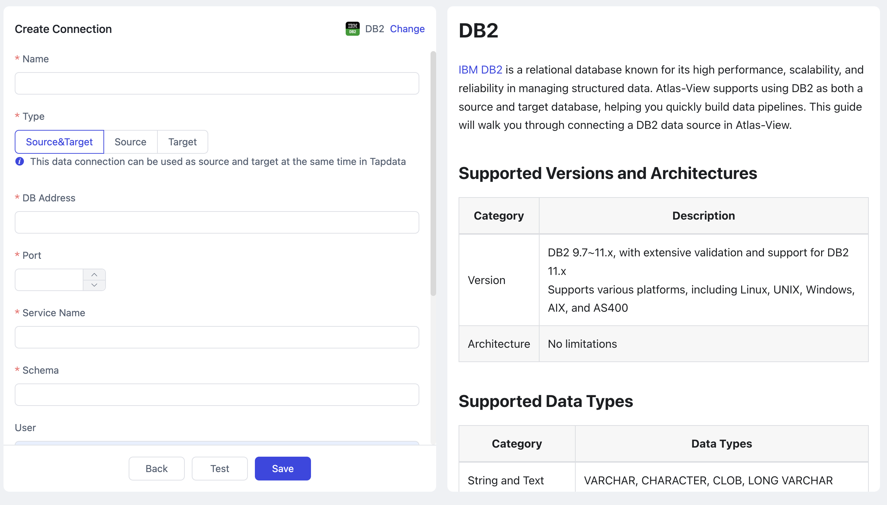

# DB2

import Content from '../reuse-content/_enterprise-and-cloud-features.md';

<Content />

[IBM DB2](https://www.ibm.com/do../DB2) is a relational database known for its high performance, scalability, and reliability in managing structured data. Atlas-View supports using DB2 as both a source and target database, helping you quickly build data pipelines. This guide will walk you through connecting a DB2 data source in Atlas-View.

```mdx-code-block
import Tabs from '@theme/Tabs';
import TabItem from '@theme/TabItem';
```

## Supported Versions and Architectures

| **Category** | **Description**                                              |
| ------------ | ------------------------------------------------------------ |
| Version      | DB2 9.7~11.x, with extensive validation and support for DB2 11.x<br />Supports various platforms, including Linux, UNIX, Windows, AIX, and AS400 |
| Architecture | No limitations                                               |

## Supported Data Types

| **Category**        | **Data Types**                                   |
| ------------------- | ------------------------------------------------ |
| String and Text     | VARCHAR, CHARACTER, CLOB, LONG VARCHAR           |
| Numeric             | INTEGER, DECIMAL, BIGINT, SMALLINT, DOUBLE, REAL |
| Date and Time       | TIMESTAMP, DATE, TIME                            |
| Boolean             | BOOLEAN                                          |
| Binary Large Object | BLOB                                             |
| XML                 | XML                                              |

## Limitations

- When performing incremental data synchronization with DB2 as the source, executing a DDL operation on the DB2 database requires running the following stored procedure immediately afterward to prevent potential synchronization failures:
  ```sql
  CALL SYSPROC.ADMIN_CMD('REORG TABLE <schema>.<table>');
  ```
- In scenarios where the ReadLog size in DB2 is very large, incremental synchronization based on a specified time may encounter slow LRI lookup initially, potentially leading to a longer time to start incremental synchronization.
- Due to variable-length fields in the DB2 database, DML operations may trigger space expansion, resulting in discrepancies between the expected and actual operation types in task monitoring or logs (e.g., insert and delete actions appearing within an update event). Although the log may not match expectations, data accuracy remains unaffected.
- Deploying a raw log service to parse DB2 incremental data changes requires configuring the service with the same national language code as the DB2 database.
  ```bash
    # UTF-8 Language Code
    DB2set DB2codepage=1208
    # GBK Language Code
    DB2set DB2codepage=1386
    # Country Code
    DB2set DB2country=86
  ```

## Considerations

When capturing incremental data changes, periodic calls to the DB2 [ReadLog API](https://www.ibm.com/do../DB2/11.5?topic=apis-DB2readlog-read-log-records) may introduce load on the database and consume network bandwidth and disk I/O resources.

## Preparation

Before connecting to a DB2 database, you need to complete account authorization and other preparatory steps. This guide provides examples assuming the DB2 database is deployed on a Linux platform.

1. Execute the following commands in sequence to create a user for data replication/transformation tasks. On Linux, log in and execute the following commands to create a DB2 database user and set a password:

   ```bash
   # Replace username with your desired username
   sudo useradd username
   sudo passwd username
   ```

2. Grant permissions to the newly created account.

   1. Log in to DB2 as a user with DBA privileges.

   2. Execute the following commands to grant object management and data read/write permissions to a specific Schema. You can customize the permissions further based on your business needs. For more details, refer to [GRANT TABLE](https://www.ibm.com/do../DB2/11.1?topic=statements-grant-table-view-nickname-privileges).

      ```mdx-code-block
      <Tabs className="unique-tabs">
      <TabItem value="Full Data Synchronization">
      ```
      ```sql
      -- Replace username and schema_name with the actual username and schema name
      GRANT ON SCHEMA schema_name TO USER username;
      ```
      </TabItem>

      <TabItem value="Incremental Data Synchronization">

      ```sql
      -- Switch to the root container
      -- Replace username with the actual username
      GRANT DBADM TO username;
      ```
      :::tip
      Since incremental extraction relies on DB2's ReadLog API, system admin or database admin privileges are required.
      :::
      </TabItem>
      </Tabs>

3. To perform incremental data synchronization, [contact the Atlas-View team](../appendix/support.md) to obtain and deploy the raw log service.

   :::tip
   To simplify the process, this service will automatically execute `ALTER TABLE <schema>.<table> DATA CAPTURE CHANGES;` after it starts, enabling table-level data change capture.
   :::

## Add DB2 Data Source

1. [Log in to Atlas-View platform](../user-guide/log-in.md).

2. In the left navigation bar, click **Connections**.

3. On the right side of the page, click **Create**.

4. In the dialog that appears, search for and select **DB2**.

5. On the page that appears, fill in the DB2 connection details as described below.

   

   * **Connection Settings**
     
     * **Name**: Enter a unique name with business significance.
     * **Type**: Specify whether DB2 is used as a source or target.
     * **DB Address**: Enter the database connection address.
     * **Port**: The service port for the database, default is 50001.
     * **Service Name**: Enter the database name.
     * **Schema**: Schema name, one connection per Schema. For multiple Schemas, create multiple data connections.
     * **Additional Connection String Parameters**: Additional connection parameters, default is empty.
     * **User** and **Password**: Enter the database username and password.
     * **Grpc Server Host**, **Grpc Server Port**: Contact the [Atlas-View Team](../appendix/support.md) for raw log collection components to capture DB2 incremental data, default service port is **50051**.
     
   * **Advanced Settings**
      * **Time Zone**: Default is UTC (0).  If changed to another timezone, it will impact the synchronization time, particularly for fields without timezone information, such as TIMESTAMP and TIME types. However, DATE types will remain unaffected.
      * **CDC Log Caching**: [Extract the incremental logs](../user-guide/advanced-settings/share-mining.md) from the source database. This allows multiple tasks to share the incremental log extraction process from the same source, reducing the load on the source database. When enabled, you also need to select a storage location for the incremental log information.
      * **Include Tables**: By default, all tables are included. You can choose to customize and specify the tables to include, separated by commas.
      * **Exclude Tables**: When enabled, you can specify tables to exclude, separated by commas.
      * **Agent Settings**: The default is automatic assignment by the platform. You can also manually specify an Agent.
      * **Model load time**: If there are less than 10,000 models in the data source, their schema will be updated every hour. But if the number of models exceeds 10,000, the refresh will take place daily at the time you have specified.
      * **Enable Heartbeat Table**: Atlas-View Cloud will generate a table named **atlas-view_heartbeat_table** in the source database, which is used to monitor the source database connection and task health.
        :::tip
        After referencing and starting the data replication/development task, the heartbeat task will be activated. At this point, you can click **View heartbeat task** to monitor the task.
        :::

6. Click **Test**. If the test passes, click **Save**.

   :::tip
   If the connection test fails, follow the prompts on the page to troubleshoot and resolve the issue.
   :::
