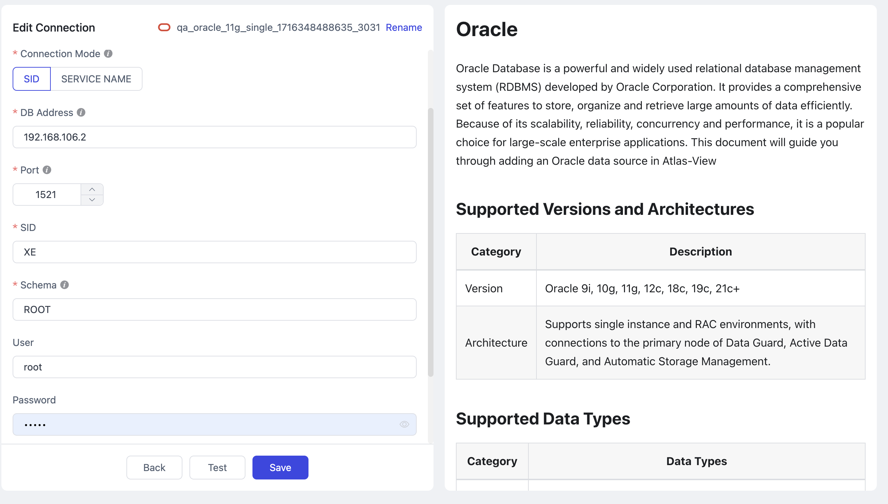

# Oracle

import Content1 from '../reuse-content/_enterprise-and-cloud-features.md';

<Content1 />

Oracle Database is a powerful and widely used relational database management system (RDBMS) developed by Oracle Corporation. It provides a comprehensive set of features to store, organize and retrieve large amounts of data efficiently. Because of its scalability, reliability, concurrency and performance, it is a popular choice for large-scale enterprise applications. This document will guide you through adding an Oracle data source in TapView


```mdx-code-block
import Tabs from '@theme/Tabs';
import TabItem from '@theme/TabItem';
```

## Supported Versions and Architectures

| **Category** | **Description**                                              |
| ------------ | ------------------------------------------------------------ |
| Version      | Oracle 9i, 10g, 11g, 12c, 18c, 19c, 21c+                          |
| Architecture | Supports single instance and RAC environments, with connections to the primary node of Data Guard, Active Data Guard, and Automatic Storage Management.|

## Supported Data Types

| Category    | Data Types                                                   |
| ----------- | ------------------------------------------------------------ |
| Strings     | VARCHAR2, CHAR, NVARCHAR2, NCHAR, CLOB, NCLOB, LONG                |
| Numbers     | NUMBER, INTEGER, FLOAT, BINARY_FLOAT, BINARY_DOUBLE          |
| Date & Time | DATE, TIMESTAMP, TIMESTAMP WITH TIME ZONE, TIMESTAMP WITH LOCAL TIME ZONE, INTERVAL YEAR TO MONTH, INTERVAL DAY TO SECOND |
| Others      | RAW, LONG RAW, BLOB, XMLTYPE(19c+)                                                 |

## Unsupported Data Types
1. XMLTYPE is not supported in versions below Oracle Database 19c
2. BFILE: not supported


## Limitations
* Log parsing speed is approximately 20,000 records per second. If incremental events exceed this rate, it may cause delays in data processing
* Due to [LogMiner limitations](https://docs.oracle.com/en/database/oracle/oracle-database/19/sutil/oracle-logminer-utility.html), the length of table and column names must not exceed 30 characters; otherwise, incremental data changes may not be captured.
* To avoid issues with virtual columns during the incremental synchronization phase, consider adding a processor or manually creating the target table structure.

## Considerations
* check the setting of the `connect_time` parameter using SQL blow, make sure its value is `UNLIMITED`, this will avoid some connect exception when doing cdc

```sql
SELECT resource_name, limit FROM dba_profiles WHERE profile=( SELECT profile FROM dba_users WHERE username = '$your_username') AND RESOURCE_NAME='CONNECT_TIME';
```

* To ensure smooth database operation, it is important to allocate sufficient storage space for archive logs and prevent overcrowding, you can use the `ALTER SYSTEM SET DB_RECOVERY_FILE_DEST_SIZE` to set the storage capacity. We recommend storing at least three days of archived logs to ensure smooth task operations and recovery in case of unexpected incidents.

## Preparation
1. Log in to Oracle Database as a user with DBA privileges.
2. Execute the following command to create a user for data synchronization/transformation tasks.

```mdx-code-block
<Tabs className="unique-tabs">
<TabItem value="Standard Mode">
```

```sql
CREATE USER username IDENTIFIED BY password;
```

</TabItem>

<TabItem value="Multitenant Mode">

```sql
-- Switch to the root container
ALTER SESSION SET CONTAINER=cdb$root;

-- Create user
CREATE USER username IDENTIFIED BY password CONTAINER=all;
```

</TabItem>
</Tabs>

   - **username**: Enter user name. If you're using Oracle in multi-tenant mode, you need to add the prefix `C##` to the username
   - **password**: Enter user's password.

3. Grant permissions to the account we just created, or you can customize permissions control based on business needs

```mdx-code-block
<Tabs className="unique-tabs">
<TabItem value="Full Data Synchronization">
```

```sql
-- Replace 'username' with the actual username
-- Under the user's own Schema
GRANT 
    CREATE SESSION
    TO username;

-- Under other Schemas (recommended)
GRANT
    CREATE SESSION,
    SELECT ANY TABLE,
TO username;   
-- If in multitenant mode, specify the container at the end of the command, e.g., CONTAINER=all
```

</TabItem>

<TabItem value="Incremental Data Synchronization">

```sql
-- Replace 'username' with the actual username
GRANT CREATE SESSION,
      ALTER SESSION,
      EXECUTE_CATALOG_ROLE,
      SELECT ANY DICTIONARY,
      SELECT ANY TRANSACTION,
      SELECT ANY TABLE
TO username;
```

:::tip
For Oracle versions 12c and above, you also need to grant `LOGMINING` permission by executing the command `GRANT LOGMINING TO username;`.
:::
</TabItem>
</Tabs>

4. If you need to obtain the data changes from the database for incremental synchronization, you also need to follow the steps below

   1. Turn on database archive mode (ARCHIVELOG). Since this involves restarting the database, perform this operation during a low-traffic period

      :::tip

      You can verify if the feature is enabled by executing the `SELECT log_mode FROM v$database` command. If the result returned is **ARCHIVELOG**, it indicates that the feature is turned on, and you can skip this step

      :::

      ```sql
      -- Shut down the database
      SHUTDOWN IMMEDIATE;
      
      -- Start and mount the database
      STARTUP MOUNT;
      
      -- Enable archiving and open the database
      ALTER DATABASE archivelog;
      ALTER DATABASE OPEN;
      ```

   2. Enable supplemental logging.

      ```sql
      -- Enable primary key supplemental logging at the database level. To disable, replace ADD with DROP
      ALTER DATABASE ADD SUPPLEMENTAL LOG DATA (PRIMARY KEY) COLUMNS;
      
      -- Enable primary key supplemental logging for a single table. Replace 'Schema' and 'table_name' with the actual names
      ALTER TABLE Schema.table_name ADD SUPPLEMENTAL LOG DATA (PRIMARY KEY) COLUMNS;
      ```

      :::tip

      If disk space is ample, you can simplify the process by enabling full supplemental logging at the database level with the command `ALTER DATABASE ADD SUPPLEMENTAL LOG DATA (ALL) COLUMNS;`.

      :::

   3. If there are tables without primary keys, choose to enable full supplemental logging (full supplemental logging) for a single table or all tables using the following commands

      ```sql
      -- Enable for a single table. Replace 'Schema' and 'table_name' with the actual names
      ALTER TABLE Schema.table_name ADD SUPPLEMENTAL LOG DATA (ALL) COLUMNS;
      
      -- Enable for all tables
      ALTER DATABASE ADD SUPPLEMENTAL LOG DATA (ALL) COLUMNS;
      ```

      :::tip

      If Oracle is in multitenant mode, it is recommended to enable this for a specific container by executing the command `ALTER SESSION SET CONTAINER=PDB_name;` before running the above commands

      :::

   4. Apply the changes

      ```sql
      ALTER SYSTEM SWITCH LOGFILE;
      ```

   5. If Oracle is in multitenant mode, you also need to execute the following command to open pluggable databases

      ```sql
      ALTER PLUGGABLE DATABASE ALL OPEN;
      ```


### <span id="ssl">Enable SSL Connection (Optional)</span>
To further enhance the security of your data connection, you can opt to enable SSL (Secure Sockets Layer) encryption for Oracle databases. This process encrypts network connections at the transport layer, thereby improving the security of communication data and ensuring data integrity.

Next, we will demonstrate the specific steps for enabling SSL on Oracle 12c deployed on a Linux platform:

1. Log into the device hosting the Oracle database and execute the following commands to adjust directory permissions and switch to the Oracle user:

   ```bash
   chown oracle:dba /opt/oracle/ -R
   su oracle
   mkdir -p /opt/oracle/wallet
   ```

2. Execute the following commands in sequence to create a directory for storing certificate files and generate a Key file. Replace `{password}` with the password you wish to set:

   ```bash
   $ORACLE_HOME/bin/orapki wallet create -wallet /opt/oracle/wallet -pwd {password} -auto_login
   $ORACLE_HOME/bin/orapki wallet add -wallet /opt/oracle/wallet -pwd {password} -dn "CN=localhost" -keysize 1024 -self_signed -validity 365
   ```

3. Run the following command to generate a jks file. Replace `{password}` with the corresponding password:

   ```bash
   $ORACLE_HOME/bin/orapki wallet pkcs12_to_jks -wallet /opt/oracle/wallet -pwd {password} -jksKeyStoreLoc /opt/oracle/wallet/oracle12c_ks.jks -jksKeyStorepwd {password} -jksTrustStoreLoc /opt/oracle/wallet/oracle12c_ts.jks -jksTrustStorepwd {password}
   ```

   To convert pem files, you can execute the following command:

   ```bash
   cd /opt/oracle/wallet && openssl pkcs12 -clcerts -nokeys -out oracle_cert.pem -in ewallet.p12
   ```

4. Create the relevant configuration files to complete the SSL setup:

   ```bash
   # Adjust the directory based on your environment
   cd /u01/app/oracle/product/12.1../network/admin
   touch listener.ora
   touch sqlnet.ora
   touch tnsnames.ora
   ```

   Add the following content to the configuration files:

```mdx-code-block
<Tabs className="unique-tabs">
<TabItem value="listener.ora">
```

```bash
# listener.ora

SSL_CLIENT_AUTHENTICATION = FALSE

WALLET_LOCATION =
  (SOURCE =
    (METHOD = FILE)
    (METHOD_DATA =
      (DIRECTORY = /opt/oracle/wallet)
    )
  )

LISTENER =
(DESCRIPTION_LIST =
  (DESCRIPTION =
    (ADDRESS = (PROTOCOL = IPC)(KEY = EXTPROC1))
    (ADDRESS = (PROTOCOL = TCP)(HOST = 0.0.0.0)(PORT = 1521))
  )
  (DESCRIPTION =
     (ADDRESS = (PROTOCOL = TCPS)(HOST = 0.0.0.0)(PORT = 2484))
   )
)

DEDICATED_THROUGH_BROKER_LISTENER=ON
DIAG_ADR_ENABLED = off
```

</TabItem>

<TabItem value="sqlnet.ora">

```bash
# sqlnet.ora

WALLET_LOCATION =
   (SOURCE =
     (METHOD = FILE)
     (METHOD_DATA =
       (DIRECTORY = /opt/oracle/wallet)
     )
   )

SQLNET.AUTHENTICATION_SERVICES = (TCPS,NTS,BEQ)
SSL_CLIENT_AUTHENTICATION = FALSE
SSL_CIPHER_SUITES = (SSL_RSA_WITH_AES_256_CBC_SHA, SSL_RSA_WITH_3DES_EDE_CBC_SHA)
```

</TabItem>

<TabItem value="tnsnames.ora">

```bash
# tnsnames.ora

SSL=
(DESCRIPTION =
  (ADDRESS = (PROTOCOL = TCPS)(HOST = 0.0.0.0)(PORT = 2484))
  (CONNECT_DATA =
    (SERVER = DEDICATED)
    (SERVICE_NAME = XE)
  )
)

XE=
(DESCRIPTION =
  (ADDRESS = (PROTOCOL = TCP)(HOST = 0.0.0.0)(PORT = 1521))
  (CONNECT_DATA =
    (SERVER = DEDICATED)
    (SERVICE_NAME = XE)
  )
)
```

</TabItem>
</Tabs>

5. During off-peak hours, execute the following commands in sequence to restart Oracle services:

   ```bash
   $ORACLE_HOME/bin/lsnrctl stop
   $ORACLE_HOME/bin/lsnrctl start
   $ORACLE_HOME/bin/sqlplus / as sysdba
   shutdown
   startup
   ```
   
6. Verify that Oracle can be logged in via SSL, for example, `$ORACLE_HOME/bin/sqlplus username/password@SSL


## Add Oracle Data Source
1. [Log in to TapView Platform](../user-guide/log-in.md)

2. In the left navigation panel, click **Connections**

3. On the right side of the page, click **Create**

4. In the pop-up dialog, select **Oracle**

5. On the page that you are redirected to, follow the instructions below to fill in the connection information for Oracle

   

   * **Connection Information Settings**
      * **Name**: Fill in a unique name that has business significance
      * **Type**: Supports Oracle as a source database
      * **Connection Mode**: Choose to connect through SID or Service Name
      * **DB Address**: The database connection address
      * **Port**: The service port of database
      * **SID**/**Service name**: Fill in the SID or Service Name information
      * **Schema**: The name of the Schema. One connection corresponds to one Schema. To connect to multiple Schemas, create separate data connections
      * **User**: The database account
      * **Password**: The database password
      * **Log plugin name**: Choose based on your business needs, with the default being **logMiner**. For more information, see [Incremental Log Retrieval Methods](#log-miner)
   * **Advanced <span id="advanced">Settings</span>**
      * **Connection Parameter String**: additional connection parameters, default empty
      * **Load Table Comment**:  Choose whether to load table comment information (default is off) to help quickly identify the business significance of tables. Note that loading a large number of comments may affect model loading efficiency
      * **Multi-tenant**: If Oracle is in multitenant mode, enable this option and enter the PDB information
      * **Use SSL**: Select whether to enable SSL connection for the data source to enhance data security. After enabling this feature, you will need to upload SSL certificate files and enter the certificate password. The relevant files can be obtained from [Enabling SSL Connection](#ssl)
      * **Timezone for datetime**: Default is set to UTC (0 timezone). If changed to another timezone, fields without timezone (such as TIMESTAMP) will be affected, while fields with timezone (such as TIMESTAMP WITH TIME ZONE) and DATE types will remain unaffected
      * **Socket Read Timeout**: Set this parameter to avoid zombie connections that may occur due to unexpected situations (e.g., socket interaction timeout) when LogMiner automatically mines incremental changes. The default value of 0 means no timeout is set
      * **Contain table**: The default option is **All**, which includes all tables. Alternatively, you can select **Custom** and manually specify the desired tables by separating their names with commas (,)
      * **Exclude tables**: Once the switch is enabled, you have the option to specify tables to be excluded. You can do this by listing the table names separated by commas (,) in case there are multiple tables to be excluded
      * **Agent settings**: Defaults to **Platform automatic allocation**, you can also manually specify an agent
      * **Model load time**: If there are less than 10,000 models in the data source, their schema will be updated every hour. But if the number of models exceeds 10,000, the refresh will take place daily at the time you have specified

6. Click **Test**, and when passed, click **Save**.

   :::tip

   If the connection test fails, follow the prompts on the page to fix it.

   :::

## Performance Testing
### Test Environment

- **Oracle Environment**: **ecs.ebmhfc6.20xlarge** instance, equipped with 80 CPU cores, 192 GB RAM, and 500GB ESSD storage
- **Table Structure**: The test table contains 53 fields, including 30 random string fields of length 8, 21 random float fields, 1 primary key field, 1 title field, and 1 date field

### Test Results

The performance tests covered both full and incremental data read/write operations. The results are as follows, which are indicative of this specific environment and not the performance limits of TapView

| **Category**                     | **Records Processed Per Second (RPS)** | **Remarks**                                    |
| -------------------------------- | -------------------------------------- | ---------------------------------------------- |
| Full Data Write                  | 240,000                                | None                                           |
| Incremental Data Write           | 12,000                                 | The ratio of INSERT, UPDATE, DELETE was 1:1:1  |
| Full Data Read                   | 300,000                                | None                                           |
| Incremental Data Read (LogMiner) | 20,000                                 | Average incremental delay is around 3 seconds  |

## FAQs

- **Q: Does Oracle support partition tables for incremental sync?**

  **A:** Incremental events from partitioned tables can be parsed, but the DDL changes for adding partitions are not currently supported

- **Q: Why does the connection limit exceed when multiple sync tasks are started on Oracle?**

  **A:** Check if the Oracle version is 11.2.0.4. This issue is an Oracle bug (ID 19587324), where LogMiner starts too many parallel query services to collect statistics

- **Q: Why is the incremental data sync delay significant when using the LogMiner method?**

  **A:** Ensure that automatic mining is enabled. The log buffer size might be set too large, which could cause delays if the actual incremental data volume is small

- **Q: Why does the QPS drop significantly for some tables during Oracle target writes?**

  **A:** The table may lack a primary key. It is recommended to configure update conditions (business logic primary key), as performance can be severely affected if the table has many fields
