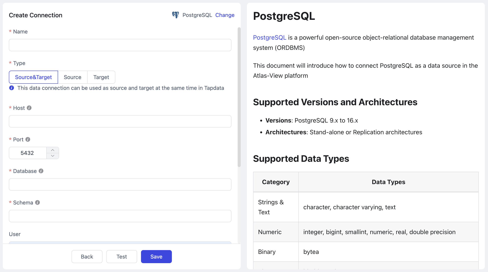

# PostgreSQL

import Content1 from '../reuse-content/_all-features.md';

<Content />

[PostgreSQL](https://www.postgresql.org/) is a powerful open-source object-relational database management system (ORDBMS)

This document will introduce how to connect PostgreSQL as a data source in the Atlas-View platform

```mdx-code-block
import Tabs from '@theme/Tabs';
import TabItem from '@theme/TabItem';
```

## Supported Versions and Architectures

* **Versions**: PostgreSQL 9.x to 16.x
* **Architectures**: Stand-alone or Replication architectures

## Supported Data Types
| Category       | Data Types                                                   |
| -------------- | ------------------------------------------------------------ |
| Strings & Text | character, character varying, text                           |
| Numeric        | integer, bigint, smallint, numeric, real, double precision   |
| Binary         | bytea                                                        |
| Bit            | bit, bit varying                                             |
| Boolean        | boolean                                                      |
| Date & Time    | timestamp without time zone, timestamp with time zone, date, time without time zone, <br />time with time zone, interval |
| Spatial Data   | geometry, point, polygon, circle, path, box, line, lseg      |
| Network Types  | inet, cidr, macaddr                                          |
| Identifier     | uuid, oid, regproc, regprocedure, regoper, regoperator, regclass, regtype, regconfig, regdictionary |
| Text Search    | tsvector, tsquery                                            |
| Others         | xml, json, array                                             |


## Limitations
- To capture incremental events for partitioned parent tables, PostgreSQL version 13 or above must be used, and the pgoutput plugin must be selected.

## Considerations
- When using log-based plugins that rely on replication slots (e.g., **wal2json**), too many shared mining processes may cause WAL log accumulation, increasing disk pressure. It's recommended to reduce the number of mining processes or promptly delete unnecessary CDC tasks and replication slots.

## Preparation
1. Log in to the PostgreSQL database as an administrator.

2. Create a user and grant permissions.

   1. Execute the following command format to create an account for data synchronization/development tasks.

      ```sql
      CREATE USER username WITH PASSWORD 'password';
      ```

      * **username**: Username.
      * **password**: Password.

   2. Execute the following command format to grant account permissions.

      ```mdx-code-block
      <Tabs className="unique-tabs">
      <TabItem value="Read Full Data Only">
      ```

      ```sql
      -- Switch to the database to be authorized
      \c database_name
      
      -- Grant table read permission for the target schema
      GRANT SELECT ON ALL TABLES IN SCHEMA schema_name TO username;
      
      -- Grant USAGE permission to schema
      GRANT USAGE ON SCHEMA schema_name TO username;
      ```
      </TabItem>
      
      <TabItem value="Read Full and Incremental Data">
      
      ```sql
      -- Switch to the database to be authorized
      \c database_name
      
      -- Grant table read permission for the target schema
      GRANT SELECT ON ALL TABLES IN SCHEMA schema_name TO username;
      
      -- Grant USAGE permission to schema
      GRANT USAGE ON SCHEMA schema_name TO username;
      
      -- Grant replication permission
      ALTER USER username REPLICATION;
      ```
      </TabItem>
      </Tabs>
      
      * **database_name**: Database name.
      * **schema_name**: Schema name.
      * **username**: Username.

3. <span id="prerequisites">Execute the following</span> command format to modify the replica identity to FULL (using the entire row as the identifier), which determines the fields recorded in the log when data undergoes UPDATE/DELETE.

   :::tip

   If you only need to read full data from PostgreSQL, you can skip this and the subsequent steps.

   :::

   ```sql
   ALTER TABLE 'schema_name'.'table_name' REPLICA IDENTITY FULL;   
   ```

   * **schema_name**: Schema name.
   * **table_name**: Table name.

4. Log in to the server hosting PostgreSQL, and choose the decoder plugin to install based on business needs and version:

   - [Wal2json](https://github.com/eulerto/wal2json/blob/master/README.md) (Recommended): Suitable for PostgreSQL 9.4 and above, converts WAL logs to JSON format, simple to use, but requires source tables to have primary keys; otherwise, delete operations cannot be synchronized.
   - [Pgoutput](https://www.postgresql.org/do../sql-createsubscription.html): An internal logical replication protocol introduced in PostgreSQL 10, no additional installation needed. For tables with primary keys and `replica identity` set to `default`, the `before` in update events will be empty, which can be solved by setting `replica identity full`. Additionally, if you do not have database-level **CREATE** permissions, you need to run the following commands to create the required PUBLICATION:

     ```sql
     CREATE PUBLICATION dbz_publication_root FOR ALL TABLES WITH (PUBLISH_VIA_PARTITION_ROOT = TRUE);
     CREATE PUBLICATION dbz_publication FOR ALL TABLES;
     ```
   - [Decoderbufs](https://github.com/debezium/postgres-decoderbufs): Suitable for PostgreSQL 9.6 and above, uses Google Protocol Buffers to parse WAL logs but requires more complex configuration.
   - [Walminer](https://gitee.com/movead/XLogMiner/tree/master/): Does not rely on logical replication, doesn't require setting `wal_level` to `logical`, or adjusting replication slot configuration, but requires superuser permissions.

   Next, we will demonstrate the installation process using **Wal2json** as an example.

   :::tip

   In this example, PostgreSQL version 12 is installed on CentOS 7. If your environment differs, you will need to adjust the installation steps for development package versions, environment variable paths, etc.

   :::

   1. Add the repository package.

      ```bash
      yum install https://download.postgresql.org/pub/repos/yum/reporpms/EL-7-x86_64/pgdg-redhat-repo-latest.noarch.rpm
      ```

   2. Install the PostgreSQL 12 development package.

      ```bash
      yum install -y postgresql12-devel
      ```

   3. Set environment variables and activate them.

      ```bash
      export PATH=$PATH:/usr/pgsql-12/bin
      source /etc/profile
      ```

   4. Install environment dependencies, including llvm, clang, gcc, etc.

      ```bash
      yum install -y devtoolset-7-llvm centos-release-scl devtoolset-7-gcc* llvm5.0
      ```

   5. Execute the following commands in sequence to complete the installation of the plugin.

      ```bash
      # Clone and enter the directory
      git clone https://github.com/eulerto/wal2json.git && cd wal2json
      
      # Enter the scl's devtoolset environment
      scl enable devtoolset-7 bash
      
      # Compile and install
      make && make install
      ```

   6. Modify the `postgresql.conf` configuration file and set the `wal_level` value to `logical`.

      :::tip

      If PostgreSQL version is 9.4, 9.5, or 9.6, also increase the values of `max_replication_slots` and `max_wal_senders` (e.g., set to 10).

      :::

   7. Modify the `pg_hba.conf` configuration file, adding the following content to ensure Atlas-View can access the database.

      ```bash
      # Replace username with the actual username
      local   replication     username                     trust
      host    replication     username  0.0.0.0/32         md5
      host    replication     username  ::1/128            trust
      ```

   8. Restart the PostgreSQL service during a low business peak period.

      ```sql
      service postgresql-12.service restart
      ```

5. (Optional) Test the log plugin.

   1. Connect to the postgres database, switch to the database to be synchronized, and create a test table.

      ```sql
      -- Suppose the database to be synchronized is demodata, and the schema is public
      \c demodata
      CREATE TABLE public.test_decode
      (
        uid    integer not null
            constraint users_pk
                primary key,
        name   varchar(50),
        age    integer,
        score  decimal
      );
      ```
   
   2. Create a Slot connection, using the wal2json plugin as an example.
   
      ```sql
      SELECT * FROM pg_create_logical_replication_slot('slot_test', 'wal2json');
      ```
   
   3. Insert a record into the test table.
   
      ```sql
      INSERT INTO public.test_decode (uid, name, age, score)
      VALUES (1, 'Jack', 18, 89);
      ```
   
   4. Listen to the log and check if there is information about the insert operation.
   
      ```sql
      SELECT * FROM pg_logical_slot_peek_changes('slot_test', null, null);
      ```
   
      Example return (displayed vertically):
   
      ```sql
      lsn  | 0/3E38E60
      xid  | 610
      data | {"change":[{"kind":"insert","schema":"public","table":"test_decode","columnnames":["uid","name","age","score"],"columntypes":["integer","character varying(50)","integer","numeric"],"columnvalues":[1,"Jack",18,89]}]}
      ```
   
   5. If there are no issues, delete the Slot connection and the test table.
   
      ```sql
      SELECT * FROM pg_drop_replication_slot('slot_test');
      DROP TABLE public.test_decode;
      ```
   
   6. (Optional) If you need to use the last update timestamp for incremental synchronization, perform the following steps.
   
      1. Execute the following command in the source database to create a common function. Replace the schema name as needed.
   
         ```sql
         CREATE OR REPLACE FUNCTION schema_name.update_lastmodified_column()
           RETURNS TRIGGER LANGUAGE plpgsql AS $$
           BEGIN
               NEW.last_update = now();
               RETURN NEW;
           END;
         $$;
         ```
   
      2. Create fields and triggers; this must be done for each table, for example, a table named **mytable**.
   
         ```sql
         // Create the last_update field
         ALTER TABLE schema_name.mytable ADD COLUMN last_update timestamp DEFAULT now();
         
         // Create a trigger
         CREATE TRIGGER trg_uptime BEFORE UPDATE ON schema_name.mytable FOR EACH ROW EXECUTE PROCEDURE
           update_lastmodified_column();
         ```
	

### <span id="enable-ssl-connection">Enable SSL Connection (Optional)</span>

To further enhance the security of the data pipeline, you can enable SSL (Secure Sockets Layer) encryption for PostgreSQL, providing encrypted network connections at the transport layer. This improves communication data security while ensuring data integrity.

1. Log in to the device hosting the PostgreSQL database and execute the following commands to create a self-signed certificate.

   ```bash
   # Generate root certificate private key (pem file)
   openssl genrsa -out ca.key 2048
   
   # Generate root certificate signing request file (csr file)
   openssl req -new -key ca.key -out ca.csr -subj "/C=CN/ST=myprovince/L=mycity/O=myorganization/OU=mygroup/CN=myCA"
   
   # Create a self-signed root certificate, valid for one year:
   openssl x509 -req -days 365 -extensions v3_ca -signkey ca.key -in ca.csr -out ca.crt
   ```

2. Execute the following commands in sequence to generate server private key and certificate.

   ```bash
   # Generate server private key
   openssl genrsa -out server.key 2048
   
   # Generate server certificate request file
   openssl req -new -key server.key -out server.csr -subj "/C=CN/ST=myprovince/L=mycity/O=myorganization/OU=mygroup/CN=myServer"
   
   # Use self-signed CA certificate to issue server certificate, valid for one year
   openssl x509 -req -days 365 -extensions v3_req -CA ca.crt -CAkey ca.key -CAcreateserial -in server.csr -out server.crt
   ```

3. (Optional) Execute `openssl verify -CAfile ca.crt server.crt` to verify whether the server certificate is correctly signed.

4. Execute the following commands in sequence to generate client private key and certificate.

   ```bash
   # Generate client private key
   openssl genrsa -out client.key 2048
   
   # Generate certificate request file, for user1 (full authentication should focus on users)
   openssl req -new -key client.key -out client.csr -subj "/C=CN/ST=myprovince/L=mycity/O=myorganization/OU=mygroup/CN=user1"
   
   # Use root certificate to issue client certificate
   openssl x509 -req -days 365 -extensions v3_req -CA ca.crt -CAkey ca.key -CAcreateserial -in client.csr -out client.crt
   ```

5. (Optional) Execute `openssl verify -CAfile ca.crt client.crt` to verify whether the client certificate is correctly signed.

6. Modify the following PostgreSQL configuration files to enable SSL and specify the relevant certificate/key files.

   ```mdx-code-block
   <Tabs className="unique-tabs">
   <TabItem value="postgresql.conf">
   ```
   ```sql
   ssl = on
   ssl_ca_file = 'ca.crt'
   ssl_cert_file = 'server.crt'
   ssl_crl_file = ''
   ssl_key_file = 'server.key'
   ssl_ciphers = 'HIGH:MEDIUM:+3DES:!aNULL' # allowed SSL ciphers
   ssl_prefer_server_ciphers = on
   ```
   </TabItem>

   <TabItem value="pg_hba.conf">

   ```sql
   hostssl all all all trust clientcert=verify-ca
   ```
   </TabItem>
   </Tabs>

## Add PostgreSQL Data Source

1. [Log in to Atlas-View Platform](../user-guide/log-in.md).

1. In the left navigation bar, click **Connections**.

2. Click **Create** on the right side of the page.

3. In the pop-up dialog box, search for and select **PostgreSQL**.

4. On the redirected page, fill in the connection information for PostgreSQL as described below.

   

   * **Connection Settings**
      * **Name**: Enter a unique name that has business significance.
      * **Type**: Supports using PostgreSQL as a source or target database.
      * **Host**: Database connection IP address or hostname.
      * **Port**: Database service port.
      * **Database**: The name of the database, i.e., one connection corresponds to one database. If there are multiple databases, multiple data connections need to be created.
      * **Schema**: Schema name.
      * **User**: Database username.
      * **Password**: Password corresponding to the database username.
      * **Log Plugin Name**: To read data changes from PostgreSQL and achieve incremental data synchronization, you need to follow the guidance in the [Preparation](#prerequisites) section to select and install the appropriate plugin.
   * **Advanced Settings**
      * **ExtParams**: Additional connection parameters, default is empty.
      * **Timezone**: Defaults to timezone 0. You can also specify it manually according to business needs. Configuring a different timezone will affect timezone-related fields, such as DATE, TIMESTAMP, TIMESTAMP WITH TIME ZONE, etc.
      * **CDC Log Caching**: [Mining the source database's](../user-guide/advanced-settings/share-mining.md) incremental logs. This allows multiple tasks to share the same source database’s incremental log mining process, reducing duplicate reads and minimizing the impact of incremental synchronization on the source database. After enabling this feature, you will need to select an external storage to store the incremental log information.
      * **Contain Table**: The default option is **All**, which includes all tables. Alternatively, you can select **Custom** and manually specify the desired tables by separating their names with commas (,).
      * **Exclude Tables**: Once the switch is enabled, you have the option to specify tables to be excluded. You can do this by listing the table names separated by commas (,) in case there are multiple tables to be excluded.
      * **Agent Settings**: Defaults to **Platform automatic allocation**, you can also manually specify an agent.
      * **Model Load Time**: If there are less than 10,000 models in the data source, their schema will be updated every hour. But if the number of models exceeds 10,000, the refresh will take place daily at the time you have specified.
      * **Enable Heartbeat Table**: Once the task references and starts using this data source, Atlas-View will create a heartbeat table named _atlas_view_heartbeat_table in the source database and update its data every 10 seconds (the database account must have relevant permissions), to monitor the health of the data source connection and task.
   * **SSL Settings**: Choose whether to [enable SSL](#enable-ssl-connection) to connect to the data source, which can further enhance data security. After enabling this function, you need to upload CA files, client certificates, and fill in the client password.

5. Click **Test**, and after passing the test, click **Save**.

   :::tip

   If the connection test fails, please follow the prompts on the page to make the necessary corrections.

   :::

## FAQs

* Q: Why does resetting a task that uses PostgreSQL as the data source fail?

  A: When resetting or deleting a task, Atlas-View needs to clean up the logical replication SLOT in the database. If the PostgreSQL database cannot be connected at this time, the reset may fail.

* Q: After running a Atlas-View task, there are many SLOTs in PostgreSQL. Can these be cleaned up?

  A: Each task using a log plugin based on replication slots will leave a SLOT in PostgreSQL if the task is temporarily stopped. Cleaning these SLOTs may cause the task to lose the offset upon restart, leading to incomplete data. If the task is no longer needed, you can reset or delete the task to clean up the SLOT in a timely manner. Additionally, if using other slot-based synchronization tools, there may be situations where the replication slot cannot be cleaned up, requiring manual handling.

* Q: What if SLOT connections cannot be deleted from the PostgreSQL master node after CDC unexpectedly disconnects?

  A: You can log in to the master node to delete the relevant SLOT to avoid it being continuously occupied. The cleaning method is as follows:

  ```sql
  -- Check if there is any information with slot_name=Atlas-View
  TABLE pg_replication_slots;
  
  -- Delete the Slot node
  select * from pg_drop_replication_slot('Atlas-View');
  ```
