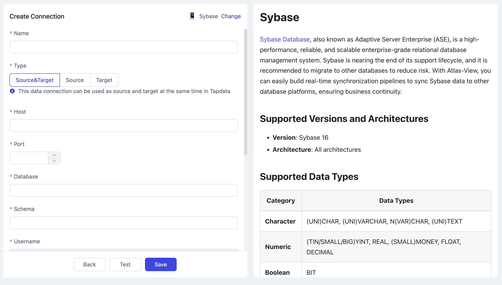

# Sybase

import Content from '../reuse-content/_enterprise-and-cloud-features.md';

<Content />

[Sybase Database](https://infocenter.sybase.com/help/index.jsp), also known as Adaptive Server Enterprise (ASE), is a high-performance, reliable, and scalable enterprise-grade relational database management system. Sybase is nearing the end of its support lifecycle, and it is recommended to migrate to other databases to reduce risk. With Atlas-View, you can easily build real-time synchronization pipelines to sync Sybase data to other database platforms, ensuring business continuity.

## Supported Versions and Architectures
* **Version**: Sybase 16
* **Architecture**: All architectures

## Supported Data Types
| **Category**  | **Data Types**                                          |
| ------------- | ------------------------------------------------------- |
| **Character** | (UNI)CHAR, (UNI)VARCHAR, N(VAR)CHAR, (UNI)TEXT          |
| **Numeric**   | (TIN/SMALL/BIG)YINT, REAL, (SMALL)MONEY, FLOAT, DECIMAL |
| **Boolean**   | BIT                                                     |
| **Date/Time** | DATE, (BIG)TIME, (SMALL/BIG)DATETIME, TIMESTAMP         |
| **Binary**    | (VAR)BINARY, IMAGE                                      |
| **LOB**       | CLOB, BLOB                                              |


## Limitations
- Due to Sybase limitations, if multiple synchronization tasks are enabled on the same database, you must enable **[Shared Mining](../user-guide/advanced-settings/share-mining.md)** in the Sybase connection and task configurations to prevent new tasks from failing to correctly sync incremental data.

## Considerations
- When performing real-time incremental synchronization from Sybase, Atlas-View will set log checkpoints to prevent log cleanup, advancing every 15 minutes, which may consume additional disk space. Suspended incremental tasks can cause transaction logs to accumulate, so it's recommended to promptly delete unneeded tasks or manually reset tasks that have been paused for a long time.
- The full data synchronization phase may consume database and bandwidth resources, so ensure that sufficient hardware resources are available. The load impact during incremental synchronization is generally within 5%.

## <span id="prerequisites">Prerequisites</span>
1. Log in to the Sybase database using a user with DBA privileges.

2. Run the following SQL commands to create a user for the synchronization task and grant the necessary permissions:

   ```sql
   create login <username> with password '<password>';
   sp_displaylogin <username>;
   sp_role 'grant', sa_role, <username>;
   sp_role 'grant', replication_role, <username>;
   sp_role 'grant', sybase_ts_role, <username>;
   ```

   * `<username>`: The username to be created.
   * `<password>`: The password for the user.

## Add Sybase Data Source
1. [Log in to Atlas-View platform](../user-guide/log-in.md).

2. In the left navigation panel, click **Connections**.

3. On the right side of the page, click **Create**.

4. In the dialog that appears, search for and select **Sybase**.

5. On the following page, fill in the connection information for Sybase based on the instructions below.

   

   * **Connection Information**
     * **Name**: Enter a unique, meaningful name.
     * **Type**: Sybase can be used as a source or target database.
     * **Host**: The database connection address.
     * **Port**: The database service port.
     * **Database**: The name of the database. Each connection corresponds to one database; if there are multiple databases, multiple connections need to be created.
     * **Schema**: The schema name.
     * **Username**: The database username.
     * **Password**: The password associated with the database account.
     * **Byte Order**: Choose between big-endian and little-endian based on the machine architecture. For example, Linux machines typically use little-endian, while some dedicated Sybase machines use big-endian. Incorrect configuration may cause inconsistent data during the incremental synchronization phase.
   * **Advanced Settings**
      * **Shared Mining**: [Mining the source database's](../user-guide/advanced-settings/share-mining.md) incremental logs allows multiple tasks to share the same source database’s incremental log mining process, reducing duplicate reads and minimizing the impact of incremental synchronization on the source database. After enabling this feature, you will need to select external storage to store the incremental log information.
      * **Include Tables**: Default is **All**. You can customize and specify the topics to include by separating table names with commas (`,`).
      * **Exclude Tables**: When enabled, you can specify topics to exclude, separated by commas (`,`).
      * **Agent Settings**: Defaults to **Platform Automatic Allocation**, but you can manually assign an agent.
      * **Model Loading Time**: If the data source has fewer than 10,000 models, they will be updated hourly. If the number exceeds this threshold, models will be reloaded daily at a time you specify.

6. Click **Test**. Once the test is successful, click **Save**.

   :::tip

   If the connection test fails, follow the on-screen instructions to resolve the issue.

   :::
