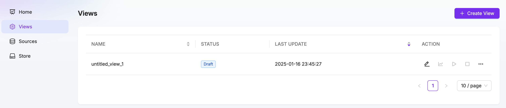
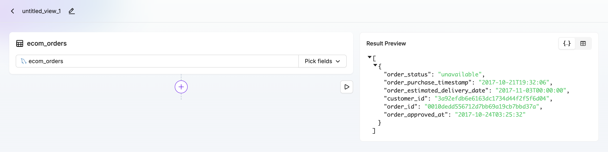
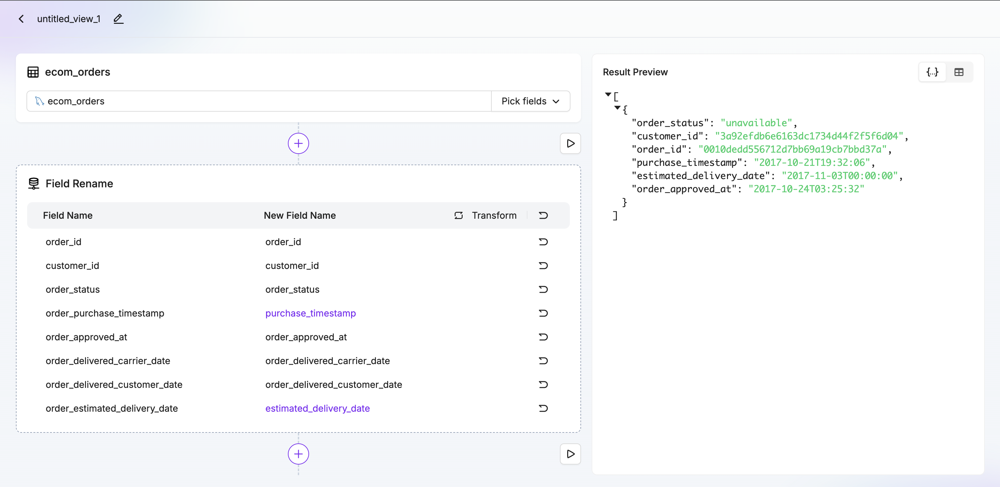
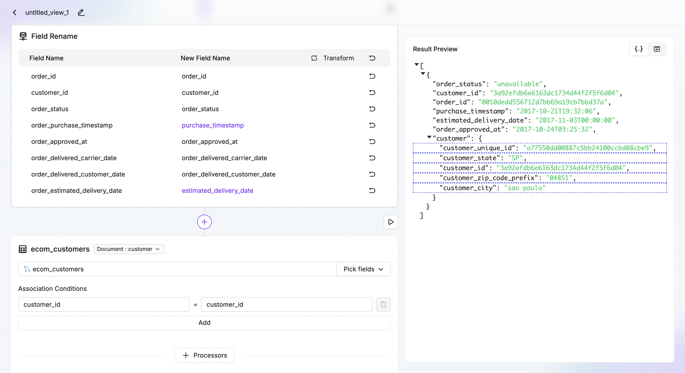
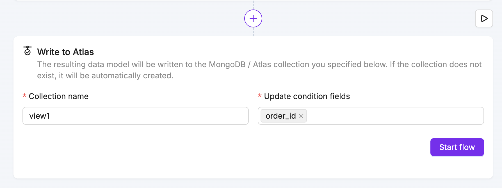
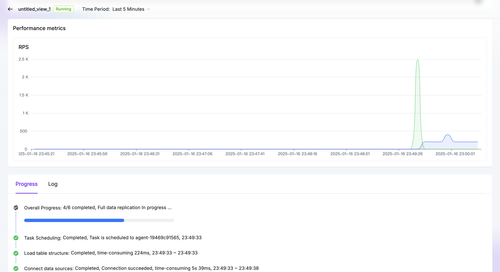
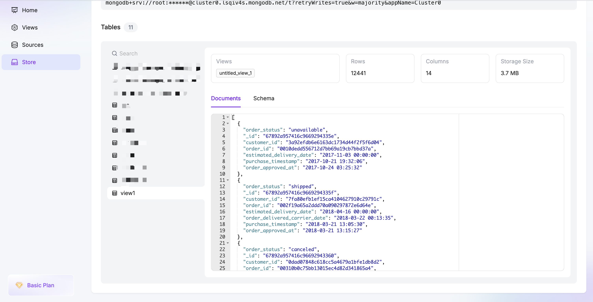

# Step 3: Create First View Task

import Content from '../reuse-content/_all-features.md';

<Content />

1.	Click on the Views navigation bar on the left, then click the Create View button on the right to enter the workflow.

2.	Select a table as the main table for the model. After selecting it, click the preview button to view the current data preview on the right. Here, select the Orders table.

3.	Click the plus button at the bottom and choose a processor. For example, use the Rename Field processor to rename fields in the Orders table. After renaming, click the preview button to see the processed data preview.

4.	Click the plus button at the bottom and select the Add Subdocument button. Add the Customers table as an associated table, set the path to customer, and choose the join condition as customer_id. Once done, click the preview button to view the associated data preview.

5.	Click the plus button at the bottom and select Write to Atlas, then choose the table to write to and specify the associated primary key. Here, select order_id.

6.	Click Start Task and observe the task entering the running state.

7.	Click Task Monitoring to navigate to the monitoring page and check the task’s running status.

8.	Click on Store in the left-hand navigation of the homepage to see the new model listed. Click the table name to preview the data. Now you can use this real-time table in Atlas!

