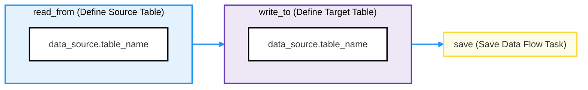

# Data Flow API

This document provides a comprehensive reference for managing data flows using the TapFlow API, including defining task sources/targets, executing data transformations, and handling advanced data flow operations.

```mdx-code-block
import Tabs from '@theme/Tabs';
import TabItem from '@theme/TabItem';
```

## Create a Data Flow Task

The core APIs for creating a data flow task include `read_from`, `write_to`, and `save`. Additionally, you can add processing nodes or set the sync type depending on your needs. Follow the tutorial below to understand both basic and advanced usage:

```mdx-code-block
<Tabs className="unique-tabs">
<TabItem value="Quick Start" default>
```

In this section, we will introduce how to use the basic `read_from`, `write_to`, and `save` APIs to create a data flow task. This is suitable for simple real-time data synchronization. The process is as follows:



- **read_from**: Specifies the main data source table for the data flow task. You can specify the source table using the `data_source_name.table_name` format. The `data_source_name` can be obtained using the `show dbs` command, or you can [create a new data source](data-source.md). For example:

  ```python
  # Specify the source table to read from
  tap> myflow = Flow("DataFlow_Test")  \
            .read_from("MongoDB_Demo.ecom_orders")
  ```

- **write_to**: Specifies the target table for the data flow task. You can define a simple target table using the `data_source_name.table_name` format. The `data_source_name` can be retrieved using the `show dbs` command, or you can [create a new data source](data-source.md). For example:

  ```python
  # Write data from the source table to ecom_orders table in the target
  tap> myflow = Flow("DataFlow_Test")  \
            .write_to("MongoDB_Demo.ecom_orders")
  ```

- **save**: Saves the current task configuration, making it a persistent task. After calling `save()`, the data flow task can be started or stopped. For example:

  ```python
  # Save the data flow task
  tap> myflow.save();
  ```

**Simple Example**

Combining all the steps into a complete example, this task reads order data from MySQL and writes it to MongoDB. After saving the task, you can run the [start](../tapcli-reference.md#start) command to begin execution.

```python
# Create a data flow task
tap> myflow = Flow("DataFlow_Advanced")  \
          .read_from("MySQL_Demo.ecom_orders")  \
          .write_to("MongoDB_Demo.Orders")  \
          .save();
```

For more advanced usage, you can further configure multi-table reading, data processing nodes, and sync types. See the **Advanced Features** tab for more details.

</TabItem>

<TabItem value="Advanced Features">

In this section, we will explore how to further configure and customize data flow tasks, suitable for scenarios involving multi-table reading, adding data processing nodes, and setting sync types. The process is as follows:

```mermaid
%%{ init: { 'theme': 'neo', 'themeVariables': { 'primaryColor': '#1E88E5', 'edgeLabelBackground':'#F1F8E9', 'tertiaryColor': '#FAFAFA'}} }%%
flowchart LR
    %% Data Source Part
    subgraph read_from["read_from (Define Source)"]
        direction LR
        table["Source Table and Reading Behavior<br> (Source API Instance)"]
    end

    %% Flow API Pipeline
    subgraph flow_api["Real-time Processing (Optional)"]
        direction TB
        process_nodes["Data Filtering<br>Rename Tables<br>Lookup<br>More..."]
    end

    %% Target Table Part
    subgraph write_to["write_to (Define Target)"]
        direction LR
        complex_target["Target Table and Write Behavior<br> (Sink API Instance)"]
    end

    %% Sync Type Configuration
    subgraph sync["Sync Type Configuration (Optional)"]
        direction TB
        sync_type["Full<br>Incremental<br>Full+Incremental"]
    end
    
    %% Save Data Flow Task
    subgraph save["save<br> (Save Data Flow Task)"]
    end   
    
    %% Data Flow Connections
    read_from --> process_nodes
    process_nodes --> write_to
    write_to --> sync
    sync --> save

    %% Style Optimization
    style read_from fill:#e3f2fd,stroke:#2196f3,stroke-width:2px,rounded
    style flow_api fill:#f1f8e9,stroke:#43a047,stroke-width:2px,rounded
    style write_to fill:#ede7f6,stroke:#673ab7,stroke-width:2px,rounded
    style sync fill:#fff3e0,stroke:#fb8c00,stroke-width:2px,rounded
    style save fill:#fffde7,stroke:#fdd835,stroke-width:2px,rounded
    style table fill:#c8e6c9,stroke:#388e3c,stroke-width:2px,rounded
    style process_nodes fill:#bbdefb,stroke:#1e88e5,stroke-width:2px,rounded
    style complex_target fill:#d1c4e9,stroke:#673ab7,stroke-width:2px,rounded
    style sync_type fill:#ffe0b2,stroke:#fb8c00,stroke-width:2px,rounded


    %% Link Style Optimization
    linkStyle default stroke-width:2px,stroke:#2196f3,curve:basis
```



- **read_from**: Specifies the [source table](data-source.md) for the data flow task. You can either define it simply using the `data_source_name.table_name` format or instantiate it using the `Source API` for more complex configurations (e.g., multi-table sync, performance optimization). For more details, see [Advanced Source Settings](#source). Example:

  ```python
  # Instantiate the source table using the Source API
  tap> source = Source('MySQL_ECommerce', table=['ecom_orders', 'ecom_customers'])
  # Configure source reading behavior
  tap> source.initial_read_size(500)  # Set full read batch size to 500 records
  tap> myflow = Flow("DataFlow_Advanced")  \
            .read_from(source)
  ```

  To use custom queries, you can specify the `query` parameter directly, e.g., `myflow.read_from("MongoDB_Demo.ecom_orders", query="SELECT * FROM ecom_orders WHERE status='active'")`.

- **Add Processing Nodes**: Before writing data to the target, you can add different types of processing nodes to perform data preprocessing, structure adjustments, and more complex tasks. For more details, see [Processing Node Documentation](#add-nodes).

- **write_to**: Specifies the [target table](data-source.md) for the data flow task. You can define it simply using the `data_source_name.table_name` format or instantiate it using the `Sink API` for more complex configurations (e.g., high-concurrency writes, write behavior). For more details, see [Advanced Sink Settings](#sink). Example:

  ```python
  # Instantiate the target table using the Sink API
  tap> sink = Sink("MongoDB_Demo", table="ecom_orders")
  # Configure target write behavior
  tap> sink.keep_data()           # Retain existing data in the target table
  tap> sink.set_write_batch(500)  # Write 500 records per batch
  tap> myflow = Flow("DataFlow_Test")  \
            .write_to(sink)
  ```

- **save**: Saves the current task configuration, making it a persistent task. After calling `save()`, the data flow task can be started or stopped.

  ```python
  # Save and create the data flow task
  tap> myflow.save();
  ```

**Complete Example**

This example demonstrates how to read multiple tables from MySQL, configure batch writes, retain existing data, and add a filtering node to keep only records where the order amount is greater than 100. The processed data is then synchronized in real-time to a MongoDB target table. After saving the task, you can run the [start](../tapcli-reference.md#start) command to execute it.

```python
# Reference an existing data source and configure multi-table sync
source = Source('MySQL_ECommerce', table=['ecom_orders', 'ecom_customers'])

# Advanced configuration for the source
source.initial_read_size(500)  # Set full read batch size to 500 records

print("Source advanced configuration complete, preparing to create the data flow task...")

# Define the target table
sink = Sink('MongoDB_Demo', table=['ecom_orders', 'ecom_customers'])

# Advanced configuration for the target
sink.keep_data()              # Retain target table structure and data
sink.set_write_batch(500)     # Write 500 records per batch

print("Target write configuration complete!")

# Create the data flow task and add processing nodes
flow = Flow("DataFlow_Advanced")  \
          .read_from(source)      \
          .filter("order_amount > 100")  # Add a filtering node to keep records where order amount > 100
          .write_to(sink)         \
          .save()

print("Data flow task configuration complete!")
```

</TabItem>
</Tabs>


## <span id="srouce">Advanced Source Configuration</span>

In TapFlow, the **`Source` API** serves as the starting point for data flow tasks. It defines data sources, table names, and task types, and it also loads the source table data required for task execution. Additionally, `Source` provides advanced features and configuration options to support data synchronization, Change Data Capture (CDC), and performance optimization.

:::tip

The advanced configuration of the `Source API` only applies to the subsequent [data flow tasks](data-flow.md). It does not modify the global default settings of the data source or affect other pre-defined data flow tasks.

:::


### Select Tables and Task Type

The **Source API** offers flexible table selection and task mode configuration for a variety of data flow scenarios:

- **Data Transformation Task** (Single Table): If the task only processes one specific table, the task type is automatically set to **data transformation task**. This mode is suitable for data modeling, ETL, data cleaning, and wide table construction.

  ```python
  # Data transformation task: Process only the ecom_orders table
  source = Source('MySQL_ECommerce', table='ecom_orders')
  ```

- **Data Replication Task** (Multiple Tables): If multiple tables or regex patterns are specified, the task is automatically set as a **data replication task**. This mode is useful for database migration, cloud migration, database backup, and multi-table synchronization.

  ```python
  # Data replication task: Specify multiple tables
  source = Source('MySQL_ECommerce', table=['ecom_orders', 'ecom_customers'])
  
  # Data replication task: Use regex to match table names
  source = Source('MySQL_ECommerce', table_re='sales_.*')
  ```

:::tip

Regular expressions are useful for dynamically tracking and syncing newly added tables.

:::


### Enable DDL Synchronization

Enable **DDL synchronization** (disabled by default) to ensure that structural changes to the source database (like adding, renaming, or deleting columns) are also synchronized to the target database.

```python
source.enableDDL()
```

:::tip

To enable DDL synchronization, the target database must also support DDL application. You can check the [list of supported data sources](../../prerequisites/supported-databases.md) for each database's support for DDL events. For more details, see [Best Practices for Handling Schema Changes](../../case-practices/best-practice/handle-schema-changes.md).

:::


### Enable MongoDB PreImage

Enable **[PreImage](https://www.mongodb.com/docs/manual/changeStreams/#change-streams-with-document-pre--and-post-images)** for MongoDB (disabled by default). When enabled, it captures the original (pre-update) values for change events, allowing audit trails or rollbacks.

```python
source.enablePreImage()
```


### Disable Update Field Completion

The **Update Field Completion** feature (enabled by default) ensures that all fields (including unchanged fields) are written to the target database during an update to ensure data consistency. To reduce storage overhead, you can disable this feature using the following command:

```python
source.disable_filling_modified_data()
```


### Set Incremental Read Batch Size

Defines the number of records to read in each batch during incremental synchronization. The default value is **1**. Increasing this value can improve throughput but may increase latency.

```python
# Set batch size to read 10 records at a time
source.increase_read_size(10)  
```


### Set Full Read Batch Size

Defines the number of records to read in each batch during full synchronization. The default value is **100**. Adjusting this value can improve performance during initial data migration.

```python
# Set batch size to read 500 records at a time
source.initial_read_size(500)  
```

### Comprehensive Configuration Example

The following example demonstrates how to configure the **Source API** to support flexible data source configuration and improve performance by increasing batch sizes for full and incremental reads.

```python
# Reference an existing data source and configure it as a data replication task for multiple tables
source = Source('MySQL_ECommerce', table=['ecom_orders', 'ecom_customers'])

# Enable DDL change synchronization
source.enableDDL()

# Set the incremental batch read size to 10 records
source.increase_read_size(10)

# Set the full batch read size to 500 records
source.initial_read_size(500)

print("Advanced data source configuration complete. Ready to create data flow tasks...")
```

By configuring advanced settings, you can optimize the performance, flexibility, and robustness of your data flow tasks. This includes enabling DDL synchronization, increasing batch sizes, and enhancing data extraction and replication processes.

## <span id="sink">Advanced Target Configuration</span>

In TapFlow, the `Sink` API serves as the endpoint for a data flow task, allowing you to define target table write configurations. `Sink` supports flexible behavior definitions and performance tuning options to meet various needs, such as full synchronization, incremental updates, and high-performance writes.

`Sink` configurations apply only to the current data flow task. They do not alter global settings of the target database or affect other data flow tasks.

### Define the Target Table

Use the `Sink` object to specify the target database and table name:

```python
# Define single target table
sink = Sink('database_name.table_name')

# Define multiple target tables
sink = Sink('database_name', table=['table_name_1', 'table_name_2'])
```

### Configure Target Table Write Behavior

`Sink` provides multiple options to address diverse business needs flexibly:

- **Preserve Target Table Data** (default): Appends new data to the target table while keeping the existing data:

  ```python
  sink.keep_data()
  ```

- **Clear Target Table Data**: Deletes all data from the table before writing, retaining the table structure:

  ```python
  sink.clean_data()
  ```

- **Drop and Recreate Target Table**: Deletes the target table and recreates it before writing:

  ```python
  sink.clean_table()
  ```

### Optimize Write Performance

For high-throughput or real-time scenarios, `Sink` offers various performance tuning options. Proper configuration of write thread count, batch size, and interval can improve efficiency, balance source data generation rates with target processing capacity, and prevent overloading the target database.

- **Incremental Write Threads**: Specifies the number of concurrent write threads for incremental synchronization tasks (default: `1`), ideal for scenarios requiring high real-time performance:

  ```python
  sink.set_cdc_threads(4)  # Use 4 threads for incremental writes
  ```

- **Full Write Threads**: Configures the number of concurrent write threads for full synchronization tasks (default: `1`), suitable for accelerating large-scale data writes:

  ```python
  sink.set_init_thread(6)  # Use 6 threads for full writes
  ```

- **Write Batch Size**: Defines the number of records per write batch (default: `500`). Adjust this based on the target database's performance and data volume:

  ```python
  sink.set_write_batch(500)  # Write 500 records per batch
  ```

- **Write Batch Interval**: Sets the time interval between write batches (default: `500` milliseconds), useful for throttling traffic to the target database:

  ```python
  sink.set_write_wait(200)  # Wait 200 milliseconds between batches
  ```

### Comprehensive Configuration Example

The following example demonstrates how to configure target table write behavior and optimize performance using the `Sink API`:

```python
# Define the target table
sink = Sink('MongoDB_Demo.orders')

# Configure write behavior
sink.keep_data()              # Preserve existing data in the target table

# Configure performance optimization parameters
sink.set_cdc_threads(4)       # Incremental task write threads
sink.set_init_thread(6)       # Full task write threads
sink.set_write_batch(500)     # Write 500 records per batch
sink.set_write_wait(200)      # Wait 200 milliseconds between batches

print("Target write configuration complete!")
```

## Config Task Sync Types

Before starting a data flow task, TapFlow supports flexible configuration of the task's synchronization type to meet various business needs, such as **full sync**, **incremental sync**, and **full + incremental sync** (the default). For incremental sync tasks, you can specify the start time to precisely control the range of incremental data collection.


### Full Data Sync Only

A full data sync task loads all historical data from the source table to the target table. It is ideal for data initialization and one-time full migrations.

```python
# Configure full sync only
tap> myflow.full_sync();
# Save task configuration
tap> myflow.save();
```


### Incremental Data Sync Only

An incremental data sync task only captures change data (CDC) from the source table. You can choose to capture changes from the current point or specify a start time for the incremental data.

**Start Incremental Sync from Task Start Time**

```python
# Configure incremental sync only, starting from the current time
tap> myflow.only_cdc();
# Save task configuration
tap> myflow.save();
```

**Start Incremental Sync from a Specified Time**

To start collecting incremental data from a specific time, use the `config_cdc_start_time` method to set the start time and time zone.

```python
# Configure incremental sync only, starting from 2023-12-14 17:40:00
tap> myflow.only_cdc();
tap> myflow.config_cdc_start_time(1702546800000, tz="+8");
# Save task configuration
tap> myflow.save();
```

**Parameters**
- **`start_time`**: The start time for incremental sync, in `datetime` or milliseconds.
- **`tz`**: Time zone offset, default is `+8` (UTC+8). Examples: `+0` (UTC) or `-5` (EST).


### Full + Incremental Data Sync (Default)

A full + incremental data sync task first completes a full sync of historical data and then continuously captures incremental changes. It is suitable for long-term tasks like real-time synchronization or data warehouse construction.

```python
# Configure full + incremental sync (default)
tap> myflow.include_cdc();
# Save task configuration
tap> myflow.save();
```

## Add Processing Nodes

### Data Preprocessing

#### Filter Data (SQL Style)

**Node Description**: The `filter` node retains or discards data records based on specified conditions. It uses SQL-style syntax, making it easy to implement simple filtering rules for global data screening. This helps improve data quality or optimize subsequent processing.

**Usage Example**: The following examples demonstrate how to retain or discard records where the order amount is greater than 100 and the user's gender is male. The processed data is then written to the target database.

```python
# Create a data flow task that retains records that meet the condition
tap> flow = Flow("Filter_Data_Test")  \
          .read_from(MySQL_Demo.ecom_orders)  \
          .filter("order_amount > 100 and user_gender='male'")  \
          .write_to(MongoDB_Demo.filteredOrders)  \
          .save();

# Create a data flow task that discards records that meet the condition
tap> flow = Flow("Filter_Data_Discard")  \
          .read_from(MySQL_Demo.ecom_orders)  \
          .filter("order_amount <= 100 or user_gender='male'", filterType=FilterType.delete)  \
          .write_to(MongoDB_Demo.filteredOrders)  \
          .save();
```


#### Filter Data (JS Style)

**Node Description**: The `rowFilter` node allows for row-by-row processing of data using expressions. You can choose to retain or discard rows that meet specific conditions. This node supports JavaScript-style expressions, making it suitable for complex logic or dynamic field processing.

**Usage Example**: The following examples demonstrate how to retain or discard records where the price is greater than 100. The processed data is then written to the target database.

```python
# Create a data flow task that retains records that meet the condition
tap> flow = Flow("Row_Filter_Test")  \
          .read_from(MySQL_Demo.ecom_orders)  \
          .rowFilter("record.price > 100")  \
          .write_to(MongoDB_Demo.highValueOrders)  \
          .save();

# Create a data flow task that discards records that meet the condition
tap> flow = Flow("Row_Filter_Discard")  \
          .read_from(MySQL_Demo.ecom_orders)  \
          .rowFilter("record.price > 100", rowFilterType=RowFilterType.discard)  \
          .write_to(MongoDB_Demo.highValueOrders)  \
          .save();
```


#### Adjust Time

**Node Description**: The `adjust_time` node adjusts the value of time fields. It is commonly used for time zone conversion or standardizing time formats.

**Usage Example**: The following example adds 8 hours to the order time and writes the results to the target database.

```python
# Create a data flow task to add 8 hours to the order time
tap> flow = Flow("Adjust_Time_Test")  \
          .read_from(MySQL_Demo.ecom_orders)  \
          .adjust_time(addHours=8, t=["order_time"])  \
          .write_to(MongoDB_Demo.adjustedOrders)  \
          .save();
```


### Data Structure Optimization

#### Rename Table

**Node Description**: The `renameTable` node adds a prefix or suffix to the target table name. It is useful for table name management or version control.

**Usage Example**: The following example adds the prefix `v1_` and suffix `_backup` to the target table name and writes the results to the target database.

```python
# Create a data flow task that renames the target table with a prefix and suffix
tap> flow = Flow("Rename_Table_Test")  \
          .read_from(MySQL_Demo.ecom_orders)  \
          .renameTable(prefix="v1_", suffix="_backup")  \
          .write_to(MongoDB_Demo.versionedTable)  \
          .save();
```


#### Add Fields

**Node Description**: The `add_fields` node adds new fields to each record. Field values can be calculated using JavaScript expressions, enabling dynamic field extension.

**Usage Example**: The following example adds two new fields, `status_flag` set to `'completed'` and `order_value` set to `100.5`, and writes the results to the `additionalFieldsCollection` in MongoDB.

```python
# Create a data flow task to add new fields and specify field values
tap> flow = Flow("Add_Field_Test")  \
          .read_from(MySQL_Demo.ecom_orders)  \
          .add_fields([['status_flag', 'String', "'completed'"], ['order_value', 'Double', '100.5']])  \
          .write_to(MongoDB_Demo.additionalFieldsCollection)  \
          .save();
```


#### Rename Fields

**Node Description**: The `rename_fields` node renames specific fields in records. It is used to improve field readability or meet specific business requirements.

**Usage Example**: The following example renames the `order_status` field to `status` and the `order_id` field to `id`. The modified records are then written to the `renamedFieldsCollection` in MongoDB.

```python
# Create a data flow task to rename specific fields
tap> flow = Flow("Rename_Fields_Test")  \
          .read_from(MySQL_Demo.ecom_orders)  \
          .rename_fields({'order_status': 'status', 'order_id': 'id'})  \
          .write_to(MongoDB_Demo.renamedFieldsCollection)  \
          .save();
```


#### Include Specific Fields

**Node Description**: The `include` node retains only specified fields in the records. This simplifies the output content and enables selective display of data.

**Usage Example**: The following example retains only the `order_status` and `order_id` fields and writes the results to the `includedFieldsCollection` in MongoDB.

```python
# Create a data flow task that retains only specific fields
tap> flow = Flow("Include_Fields_Test")  \
          .read_from(MySQL_Demo.ecom_orders)  \
          .include("order_status", "order_id")  \
          .write_to(MongoDB_Demo.includedFieldsCollection)  \
          .save();
```


#### Exclude Specific Fields

**Node Description**: The `exclude` node removes specified fields from the records, often used to hide sensitive information or remove unnecessary fields.

**Usage Example**: The following example excludes the `order_status` and `order_delivered_customer_date` fields and writes the results to the `excludedFieldsCollection` in MongoDB.

```python
# Create a data flow task that excludes specific fields
tap> flow = Flow("Exclude_Fields_Test")  \
          .read_from(MySQL_Demo.ecom_orders)  \
          .exclude("order_status", "order_delivered_customer_date")  \
          .write_to(MongoDB_Demo.excludedFieldsCollection)  \
          .save();
```


#### Filter Field Types

**Node Description**: The `exclude_type` node removes fields of a specific data type from records. It is commonly used to clean up unnecessary data types, such as large objects or unstructured fields.

**Usage Example**: The following example removes fields of type `OBJECT_ID` and writes the results to the `cleanedOrders` collection in MongoDB.

```python
# Create a data flow task to exclude fields of the OBJECT_ID type
tap> flow = Flow("Exclude_Type_Test")  \
          .read_from(MySQL_Demo.ecom_orders)  \
          .exclude_type("OBJECT_ID")  \
          .write_to(MongoDB_Demo.cleanedOrders)  \
          .save();
```


#### Add Timestamp Field

**Node Description**: The `add_date_field` node adds a timestamp field to each data record, which is useful for data auditing or logging.

**Usage Example**: The following example adds a field `processed_time` to each record to track when it was processed.

```python
# Create a data flow task to add a timestamp field to each data record
tap> flow = Flow("Add_Date_Field_Test")  \
          .read_from(MySQL_Demo.ecom_orders)  \
          .add_date_field("processed_time")  \
          .write_to(MongoDB_Demo.timestampedOrders)  \
          .save();
```


### Data Enhancement Processing

#### Lookup Processing

**Node Description**: Performs a left join-like operation across multiple source tables, embedding data from related tables into the main table to create wide tables, often used in real-time data consolidation scenarios.

**Parameter Descriptions**:

- **from_table_name**: The related table’s name in the format `data_source_name.table_name`.
- **relation**: Mapping of join fields for an equality join between the main and related tables.
- **embed_path** (optional): The path where the associated data will be embedded. It can embed the data as a sub-document (`object`, default) or as an array (`array`).
- **embed_type** (optional): Specifies the type of the embedded data structure. The default is `object`, representing a **one-to-one** relationship, while `array` is used for a **one-to-many** relationship.
- **includes**(optional): Specifies the fields to include in the result. Field names should be separated by commas.

**Example**:

This example demonstrates using `lookup` to embed data from the `order_payments` table into `ecom_orders`, creating a wide table with order and payment details, and writing the result to the `ordersWithPayments` collection in MongoDB.

```python
tap> flow = Flow("Order_Payment_Join")
          .read_from(mySqlSource.ecom_orders)
          .lookup("mySqlSource.order_payments", relation=[["order_id", "order_id"]],
                  embed_path="payments", embed_type="array")
          .write_to(mongodbSource.ordersWithPayments)
          .save();
```


Here, `ecom_orders` is the main table, `order_payments` is the related table, joined by `order_id`. The payments data is embedded under the `payments` field as an array, allowing one-to-many data integration.

#### JS Processing

**Node Description**: Embeds JavaScript code within the data flow task to allow custom processing of data from the source. For more details, refer to [Standard](../../appendix/standard-js.md) / [Enhanced](../../appendix/standard-js.md) JS built-in functions.

**Example**: The following example adds a confirmation status field to delivered orders in a JavaScript processing node. The processed records are then written to the `updatedCollection` collection in MongoDB.

```python
# Defining JavaScript code to add a confirmation status to delivered orders
tap> jscode = '''
if (record.order_status == 'delivered') {
    record.confirmation_status = 1;  // Adds a confirmation field to delivered orders
}
return record;  // Returns the processed record
'''

# Creating a data flow task, applying JavaScript code, and writing results to the target database
tap> flow = Flow("Order_Status_Update")  \
          .read_from(mySqlSource.ecom_orders)  \
          .js(jscode)  \
          .write_to(mongodbSource.updatedCollection)  \
          .save();
```


#### Python Processing

**Node Description**: Embeds Python functions within the data flow task to filter and transform data according to custom logic.

**Example**: The following example defines a Python function `pyfunc` to keep only delivered orders, filtering out other records. The processed records are then written to the `pythonProcessedCollection` collection in MongoDB.

```python
# Defining a Python function to retain only delivered orders
tap> def pyfunc(record):
         if record['order_status'] != 'delivered':
             return None  # Return None to filter out records that don't meet the condition
         return record  # Returns the processed record

# Creating a data flow task, applying Python function, and writing results to the target database
tap> flow = Flow("Python_Function")  \
          .read_from(mySqlSource.ecom_orders)  \
          .py(pyfunc)  \
          .write_to(mongodbSource.pythonProcessedCollection)  \
          .save();
```

## See also

Manage flow tasks through [Tap Shell](../tapcli-reference), including starting and stopping tasks, checking task status, deleting tasks, and more.

