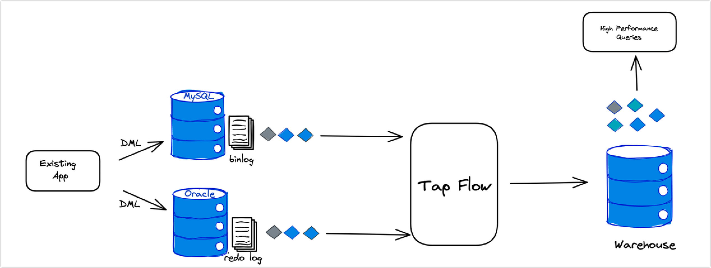

# Introduction to TapFlow

**Tap Flow** is an API framework for the TapData Live Data Platform, offering a programmable interface for tasks such as managing replication pipelines, building wide tables or materialized views, and performing general data integration. The framework currently includes a Python SDK and an interactive CLI for flexible development and management.

## How It Works

Typical application scenarios for TapFlow involve the following main data processing steps:

- **Data Collection**: Using Tap [Change Data Capture](../introduction/change-data-capture-mechanism.md) (CDC), it connects to and monitors update events (such as insert, update, and delete operations) in data sources, transforming them into data streams.
- **Data Stream Processing**: Allows users to perform real-time processing on data streams via API or graphical interface, including complex operations like data merging, cleansing, and transformation.
- **Data Storage or Output**: The processed data streams can be saved to materialized views to support fast queries and application services or sent directly to downstream databases or message queues (such as Kafka) for rapid data transmission.
