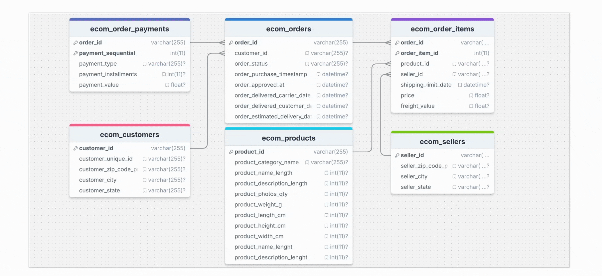

# Builde Real-Time Wide Table with TapFlow

TapFlow is a programming framework that supports real-time data replication, data processing, and materialized view creation. It offers APIs, a Python SDK, and command-line tools (Tap Shell) to efficiently build and manage data flow tasks. This guide demonstrates using Tap Shell and the Python SDK to build a real-time wide table to support efficient queries in an e-commerce application by joining multiple tables of order information.

```mdx-code-block
import Tabs from '@theme/Tabs';
import TabItem from '@theme/TabItem';
```

## Background

As the business and data volume grows, the e-commerce company **XYZ** faces challenges in order and inventory management. Order data and inventory information are distributed across multiple database tables, and operations personnel often need to perform complex cross-table queries for order details. The primary challenges are:

- **High Query Latency**: Order detail queries rely on complex cross-table joins, which impacts query performance, especially during peak times.
- **Data Inconsistency**: Ensuring data consistency across multiple tables in high-concurrency scenarios is challenging, increasing the risk of inconsistencies.
- **Lack of Real-Time Updates**: Changes in order status or inventory are not reflected promptly, making it difficult for users to access up-to-date information.


To address these challenges, the company uses **TapFlow** to build a real-time wide table, consolidating order, customer, payment, and product data in MongoDB to support high-concurrency mobile API queries. Here’s an overview of the process:

1. **Data Integration**: TapFlow uses CDC to monitor real-time changes in source tables, capturing updates to order, customer, and payment data and transferring them to MongoDB.
2. **Wide Table Generation**: TapFlow's lookup feature combines data from multiple tables into a single wide table, embedding customer, product, and payment information into the order record for simplified queries.
3. **Real-Time Updates**: When source data changes, TapFlow synchronizes incremental updates to the MongoDB wide table, ensuring the query content is always up-to-date.



By using TapFlow, XYZ enables real-time synchronization and fast querying of order and inventory information. Operations staff can access the latest order data instantly, significantly improving the user experience. The wide table consolidates order, customer, product, and logistics information in MongoDB, reducing cross-table join resource consumption and improving query efficiency and system performance.

Next, we’ll walk through setting up TapFlow to meet these requirements.

## Prerequisites

Install Tap Shell and add MySQL/MongoDB data sources. For detailed steps, see [Quick Start](../quick-start.md).

## Step 1: Builde a Real-Time Wide Table

```mdx-code-block
<Tabs className="unique-tabs">
<TabItem value="Using Interactive Shell" default>
```

In this example, the MySQL data source is named `MySQL_ECommerce`, and the MongoDB data source is named `MongoDB_ECommerce`. We will build the real-time wide table using Tap Shell commands.

1. Run `tap` to open the Tap Shell command interface.

2. Specify the source table for the data flow.

   ```python
   # Create a data data flow task and set the primary table "ecom_orders" as the data flow entry point
   orderFlow = Flow("Order_SingleView_Sync") \
         .read_from("MySQL_ECommerce.ecom_orders");  # Set MySQL source table ecom_orders
   ```

3. Add `lookup` processing nodes to perform LEFT JOIN associations with other tables. Each `lookup` command embeds data from a related table into the primary table, defining the join key with the `relation` parameter. The `orderFlow` data stream then contains enriched information on orders, customers, payments, products, and sellers.

   ```python
   # Embed 'ecom_customers' table data into the order table based on the customer_id field
   orderFlow.lookup("MySQL_ECommerce.ecom_customers", 
                     path="customer_info",                   # MongoDB embedding path
                     type="object",                          # Embed type as object
                     relation=[["customer_id", "customer_id"]]);  # Join on customer_id
   
   # Embed 'ecom_order_payments' table data as an array in the order table based on order_id
   orderFlow.lookup("MySQL_ECommerce.ecom_order_payments", 
                     path="order_payments",                  # MongoDB embedding path
                     type="array",                           # Embed type as array
                     relation=[["order_id", "order_id"]]);   # Join on order_id
   
   # Embed 'ecom_order_items' table data as an array in the order table based on order_id
   orderFlow.lookup("MySQL_ECommerce.ecom_order_items", 
                     path="order_items",                     # MongoDB embedding path
                     type="array",                           # Embed type as array
                     relation=[["order_id", "order_id"]]);   # Join on order_id
   
   # Embed 'ecom_products' table data as an object in the order_items array based on product_id
   orderFlow.lookup("MySQL_ECommerce.ecom_products", 
                     path="order_items.product",             # Embed path points to order_items.product
                     type="object",                          # Embed type as object
                     relation=[["product_id", "order_items.product_id"]]);  # Join on product_id
   
   # Embed 'ecom_sellers' table data as an object in the order_items array based on seller_id
   orderFlow.lookup("MySQL_ECommerce.ecom_sellers", 
                     path="order_items.seller",              # Embed path points to order_items.seller
                     type="object",                          # Embed type as object
                     relation=[["seller_id", "order_items.seller_id"]]);  # Join on seller_id
   ```

4. Specify MongoDB as the output destination, saving the consolidated data in a collection called `orderSingleView`.

   ```python
   # Specify MongoDB collection name for data write
   orderFlow.write_to("MongoDB_ECommerce.orderSingleView");
   # Save the data flow configuration
   orderFlow.save()
   ```

5. Run `orderFlow.start()` to start the task. After the task starts, use the `status` command to monitor the task’s status, as shown below:

   ```python
   status Order_SingleView_Sync
   job current status is: running, qps is: 3521.2, total rows: 99441, delay is: 332ms 
   ```

6. (Optional) Access the target MongoDB database to confirm that the record count matches the source.

   ```python
   use MongoDB_ECommerce
   count orderSingleView
   ```


</TabItem>
<TabItem value="Using Python Script">

Below is a complete Python example demonstrating how to use TapFlow to join multiple MySQL tables in real time to create a MongoDB wide-table view. You can execute it using `tap -f real_time_order_view.py`:

- **Main Table**: `ecom_orders`, containing basic order information.
- **Associated Tables**: `ecom_customers` (customer info), `ecom_order_payments` (payment info), `ecom_order_items` (product info), etc.
- **Output**: `orderSingleView` collection in MongoDB, containing complete order information along with its associated customer, payment, product, and seller details.

```python title="real-time-wide-table.py"
# Import TapFlow dependencies
from tapflow.lib import *

# Create a data flow task
orderFlow = Flow("Order_SingleView_Sync")

# Specify the main table ecom_orders
orderFlow.read_from("MySQL_ECommerce.ecom_orders")

# Join the customer information table
orderFlow.lookup("MySQL_ECommerce.ecom_customers", 
                 path="customer_info", 
                 type="object", 
                 relation=[["customer_id", "customer_id"]])

# Join the payment information table
orderFlow.lookup("MySQL_ECommerce.ecom_order_payments", 
                 path="order_payments", 
                 type="array", 
                 relation=[["order_id", "order_id"]])

# Join the order items table
orderFlow.lookup("MySQL_ECommerce.ecom_order_items", 
                 path="order_items", 
                 type="array", 
                 relation=[["order_id", "order_id"]])

# Join the product information table
orderFlow.lookup("MySQL_ECommerce.ecom_products", 
                 path="order_items.product", 
                 type="object", 
                 relation=[["product_id", "order_items.product_id"]])

# Join the seller information table
orderFlow.lookup("MySQL_ECommerce.ecom_sellers", 
                 path="order_items.seller", 
                 type="object", 
                 relation=[["seller_id", "order_items.seller_id"]])

# Specify the target collection
orderFlow.write_to("MongoDB_ECommerce.orderSingleView")

# Save and start the task
orderFlow.save()
orderFlow.start()
print("Real-time wide-table task has started.")

# Monitor the task status
while True:
    status = orderFlow.status()
    if status == "running":
        print(f"Task status: {status}")
        break
    elif status == "error":
        print("Task failed to start. Please check the configuration or logs.")
        break
```

The program outputs as follows during execution:

```bash
Flow updated: source added
Flow updated: source added
Flow updated: new table ecom_customers added as child table                          
Flow updated: source added
Flow updated: new table ecom_order_payments added as child table                     
Flow updated: source added
Flow updated: new table ecom_order_items added as child table                        
Flow updated: source added
Flow updated: new table ecom_products added as child table                           
Flow updated: source added
Flow updated: new table ecom_sellers added as child table                            
Flow updated: sink added
Real-time wide-table task has started.
Task status: running
```

</TabItem>
</Tabs>


## Step 2: Verify Real-Time Performance

E-commerce company **XYZ** needs to process user orders and track each order's details within the system. Every time a user places an order, the order’s basic information, customer details, order items, product information, and seller information are recorded in the database, and the status updates when the order ships. With TapFlow, this information is synchronized in real-time to MongoDB for API queries, ensuring users see up-to-date order information.

The following steps simulate data flow in a real-world business scenario by manually inserting data into MySQL.

1. Log in to the source MySQL database and run the following commands to simulate a new order created by a user.

   ```sql
   -- Insert customer information
   INSERT INTO ecom_customers (customer_id, customer_unique_id, customer_zip_code_prefix, customer_city, customer_state)
   VALUES ('CUST12345', 'UNIQUE_CUST_00123', '10001', 'New York', 'NY');
   
   -- Insert order information
   INSERT INTO ecom_orders (order_id, customer_id, order_status, order_purchase_timestamp, order_approved_at, order_estimated_delivery_date)
   VALUES ('ORD789654', 'CUST12345', 'pending', NOW(), NOW(), '2024-11-10');
   
   -- Insert order item information (includes product and seller details)
   INSERT INTO ecom_order_items (order_id, order_item_id, product_id, seller_id, shipping_limit_date, price, freight_value)
   VALUES ('ORD789654', 1, 'PROD56789', 'SELL34567', '2024-11-05', 199.99, 15.0);
   
   -- Insert product information
   INSERT INTO ecom_products (product_id, product_category_name, product_weight_g, product_length_cm, product_height_cm, product_width_cm)
   VALUES ('PROD56789', 'electronics', 1200, 20, 10, 8);
   
   -- Insert seller information
   INSERT INTO ecom_sellers (seller_id, seller_zip_code_prefix, seller_city, seller_state)
   VALUES ('SELL34567', '90001', 'Los Angeles', 'CA');
   
   -- Insert payment information
   INSERT INTO ecom_order_payments (order_id, payment_sequential, payment_type, payment_installments, payment_value)
   VALUES ('ORD789654', 1, 'credit_card', 1, 199.99);
   ```

   :::tip

   Once data is inserted, TapFlow automatically parses the Binlog for real-time data changes, processes them, and writes them to MongoDB’s `orderSingleView` collection.

   :::

2. To simulate order updates, run the following commands to update shipment, payment, and order information.

   ```sql
   -- Update order status and shipping date
   UPDATE ecom_orders
   SET order_status = 'shipped', order_delivered_carrier_date = NOW()
   WHERE order_id = 'ORD789654';
   
   -- Update payment information to increase payment amount
   UPDATE ecom_order_payments
   SET payment_value = 220.0, payment_installments = 2
   WHERE order_id = 'ORD789654' AND payment_sequential = 1;

   -- Update order item details, such as price and freight cost
   UPDATE ecom_order_items
   SET price = 210.0, freight_value = 18.0
   WHERE order_id = 'ORD789654' AND order_item_id = 1;
   ```

3. Log in to the MongoDB database, and query the collection for the `order_id = ORD789654`. You will see the changes reflected in real time with embedded JSON structures, making it easy to integrate with backend APIs for efficient querying, greatly improving business responsiveness and user experience.

   ```json
   # In the following example, key information is highlighted, 
   # while less relevant data is omitted for clarity.
   {
     "_id": {
       "$oid": "67262caa09771da27c15c713"
     },
     // highlight-next-line
     "order_id": "ORD789654",       // Newly added order
     "customer_id": "CUST12345",
     // highlight-next-line
     "order_status": "shipped",     // Updated shipping status
     "order_purchase_timestamp": "2024-11-02T10:20:00.000Z",
     "order_approved_at": "2024-11-02T10:22:00.000Z",
     // highlight-next-line
     "order_delivered_carrier_date": "2024-11-02T18:00:00.000Z",  // Updated delivery time
     "order_estimated_delivery_date": "2024-11-10T00:00:00.000Z",
     "order_payments": [
       {
         "payment_type": "credit_card",
         // highlight-start
         "payment_installments": 2,  // Updated payment installments
         "payment_value": 220,       // Updated payment amount
         // highlight-end
         "payment_sequential": 1
       }
     ],
     "order_items": [
       {
         "order_item_id": 1,
         // highlight-start
         "price": 210,               // Updated product price
         "freight_value": 18,        // Updated shipping cost
         // highlight-end
         "product_id": "PROD56789",
         "shipping_limit_date": "2024-11-05T00:00:00.000Z",
         "seller": {...},
         "product": {...},
       }
     ],
     ...
   }
   ```

## See also

[Publish Data as API](../../user-guide/data-service/create-api-service.md)