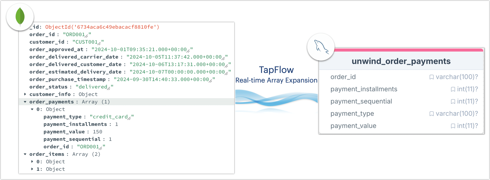

# Expand MongoDB Arrays to MySQL in Real Time with TapFlow

TapFlow offers powerful data transformation and processing capabilities, enabling seamless conversion of nested array structures in document models to relational table structures. This guide demonstrates how to unfold nested arrays from MongoDB documents and synchronize them in real-time with MySQL flat tables, supporting efficient relational database queries and data analysis.

```mdx-code-block
import Tabs from '@theme/Tabs';
import TabItem from '@theme/TabItem';
```

## Background

In modern e-commerce applications, order information typically includes multiple payment records, product items, and customer details. These datasets are often stored in NoSQL databases like MongoDB in a nested array format, simplifying design and querying on the application side. However, when performing complex analytics or integrating data into other relational systems, this structure presents challenges.

In this example, an e-commerce company aims to conduct independent analysis of order payment records to generate detailed reports and multidimensional statistics for better business decision-making. However, generating reports from MongoDB’s nested array structure proves inefficient and incompatible with relational database analytics, resulting in complex query logic and slow performance. Example data is shown below:

```json
{
    "_id": ObjectId("66f7e633f72882271da1a2ec"),
    "order_id": "0005a1a1728c9d785b8e2b08b904576c",
    "customer_id": "16150771dfd4776261284213b89c304e",
    "order_status": "delivered",
    "order_payments": [
        {
            "payment_type": "credit_card",
            "payment_installments": 3,
            "payment_value": 157.60,
            "payment_sequential": 1,
            "order_id": "0005a1a1728c9d785b8e2b08b904576c"
        },
        ...
    ],
    ...
}
```

To support traditional relational analysis requirements, we propose a solution using TapFlow to expand MongoDB’s nested order arrays (e.g., `order_payments`) into independent rows in MySQL, ensuring that analytical teams can leverage SQL queries to generate efficient reports and perform data mining. The flow is as follows:



Additionally, TapFlow’s real-time sync capabilities ensure that MySQL reflects the latest data from MongoDB, helping the company improve query performance while maintaining data freshness, thus enabling the analytics team to access timely business data and make informed decisions.

## Prerequisites

Install Tap Shell and configure MySQL and MongoDB data sources as described in [Quick Start](../quick-start.md).

## Procedures

```mdx-code-block
<Tabs className="unique-tabs">
<TabItem value="Using Interactive Shell" default>
```

Next, we demonstrate how to expand the `order_payments` array and rename fields for easier identification.

1. Enter Tap Shell by running `tap` in the command line.

2. Create a data flow task named `MySQL_to_MongoDB_Order` and set `order_collection` as the data source.

   ```python
   # Create data flow task object and set source collection
   Unwind_MongoDB_Array = Flow("MySQL_to_MongoDB_Order") \
          .read_from("MongoDB_Demo.order_collection") 
   ```

3. Run the following command to call the `include` method, selecting only the `order_payments` array field, and then apply `flat_unwind` to expand the array, converting each `order_payments` item into an individual row. Fields are separated by underscores (`_`).

   ```python
   # Retain and expand only the order_payments array field
   Unwind_MongoDB_Array.include("order_payments") \
          .flat_unwind(path="order_payments", index_name="", array_elem="OBJECT", joiner="_")
   ```

4. Use `rename_fields` to remove prefixes from field names, aligning them with the MySQL target table’s naming conventions.

   ```python
   # Rename fields to simplify field names
   Unwind_MongoDB_Array.rename_fields({
       "order_payments_order_id": "order_id",
       "order_payments_payment_type": "payment_type",
       "order_payments_payment_installments": "payment_installments",
       "order_payments_payment_value": "payment_value",
       "order_payments_payment_sequential": "payment_sequential"
   })
   ```

5. Specify the MySQL target table `unwind_order_payments` and set primary keys `order_id` and `payment_sequential` for data updates. Save the current data flow configuration.

   ```python
   # Specify MySQL target table and save task configuration
   Unwind_MongoDB_Array.write_to("MySQL_Demo.unwind_order_payments", pk=["order_id", "payment_sequential"]).save()
   ```

   If the target table does not exist, TapFlow will automatically create it.

6. Start the data flow task.

   ```python
   # Start the data flow task
   Unwind_MongoDB_Array.start()
   ```

   After the task starts, TapFlow continuously captures changes in the MongoDB source and transforms each `order_payments` array element, synchronizing it in real-time with the MySQL target table.

7. While the task runs, you can check the task status and statistics using the command `status MySQL_to_MongoDB_Order`.

   Additionally, you can [monitor the task status through the Web UI](../../user-guide/data-development/monitor-task).

</TabItem>
<TabItem value="Using Python Script">

Below is a complete Python example demonstrating how to use TapFlow to unwind the `order_payments` array in MongoDB and synchronize it to a MySQL table while renaming fields for easier business usage. You can run the script using `tap -f unwind_mongo_array.py`:

- **Data Source**: `MongoDB_Demo.order_collection` collection, containing a nested `order_payments` array field.
- **Processing Logic**: Store each element of the array field as a separate row in the target table and set primary keys for real-time updates.
- **Output**: The processed data is saved in real time to the `unwind_order_payments` table in the MySQL database, with fields expanded and renamed.

```python title="unwind_mongo_array.py"
# Import TapFlow dependencies
from tapflow.lib import *

# Create a data flow task
flow = Flow("Unwind_MongoDB_Array")

# Specify the source MongoDB collection
flow.read_from("MongoDB_Demo.order_collection")

# Retain and unwind the order_payments array field
flow.include("order_payments") \
    .flat_unwind(
        path="order_payments", 
        index_name="", 
        array_elem="OBJECT", 
        joiner="_"
    )

# Rename the expanded fields
flow.rename_fields({
    "order_payments_order_id": "order_id",
    "order_payments_payment_type": "payment_type",
    "order_payments_payment_installments": "payment_installments",
    "order_payments_payment_value": "payment_value",
    "order_payments_payment_sequential": "payment_sequential"
})

# Specify the MySQL target table and set primary keys
flow.write_to(
    "MySQL_Demo.unwind_order_payments", 
    pk=["order_id", "payment_sequential"]
)

# Save the data flow configuration
flow.save()

# Start the data flow task
flow.start()
print("Unwind and synchronize data flow task has started.")

# Output task status
while True:
    status = flow.status()
    print(f"Task status: {status}")
    if status == "running":
        break
    elif status == "error":
        print("Task failed to start. Please check the configuration or logs.")
        break
```

</TabItem>
</Tabs>


## Verification

Log in to the target MySQL database and query the `unwind_order_payments` table:

```sql
-- View transformed table data
SELECT * FROM unwind_order_payments LIMIT 1;
```

The example result below shows each element in the `order_payments` array converted into a separate row with clear and intuitive field names, facilitating subsequent queries and maintenance.

```sql
-- Example query result
order_id|payment_installments|payment_sequential|payment_type|payment_value|
--------+--------------------+------------------+------------+-------------+
ORD001  |                   1|                 1|credit_card |          150|
```
