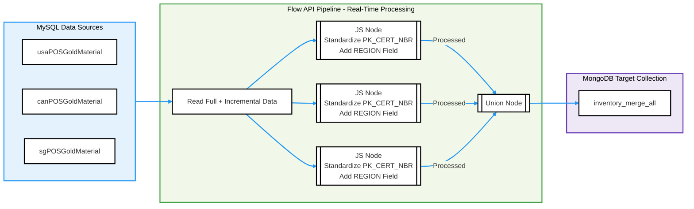

# Consolidate and Standardize Multi-Table Data with TapFlow

TapFlow offers robust data transformation and integration capabilities, enabling the consolidation of multiple regional MySQL inventory tables into a unified MongoDB collection. This case study demonstrates how to leverage TapFlow's processing power to standardize and merge Point-of-Sale (POS) inventory data from different regions into a unified collection in MongoDB, supporting unified inventory queries and analytics across regions.

## Background

A global retail company maintains separate POS inventory tables in MySQL databases for Canada, the United States, and Singapore, with identical table structures for regional operations. These tables are designed for efficient regional management but present challenges when performing global inventory analysis, including:

- **Difficulty in Cross-Region Queries**: Queries require multi-table joins, resulting in inefficiencies, especially under high query concurrency.
- **Complex Data Integration**: Minor differences in column formats, such as the `PK_CERT_NBR` field, hinder unified reporting and analytics.
- **Lack of Real-Time Insights**: Inability to access up-to-date inventory changes across all regions affects decision-making speed.

TapFlow addresses these issues by using the `union` function to merge multiple tables and applying JavaScript logic to standardize key fields. The consolidated data is stored in MongoDB, providing a real-time, unified inventory view for efficient querying and analytics. The data flow diagram is as follows:



## Prerequisites

Install Tap Shell and ensure connectivity to MySQL and MongoDB databases. Refer to the [Quick Start Guide](../quick-start.md) for installation and setup.

For clarity, this example assumes all regional tables are in the same MySQL database (`MySQL_Demo`) and the target MongoDB database is named `MongoDB_Demo`.

## Procedure

This guide demonstrates how to consolidate regional inventory data into MongoDB while standardizing fields such as `PK_CERT_NBR` and adding a region identifier for each record.

1. Enter Tap Shell by running `tap` in the command line.

2. Add JavaScript Processing Logic.

   Add a `FROM` field to identify the region (e.g., `usaWarehouse`) and standardize the `PK_CERT_NBR` field by extracting the substring before the `|` delimiter. If no delimiter exists, retain the original value. For more details, refer to [Standard JS](../../appendix/standard-js.md) and [Enhanced JS](../../appendix/standard-js.md).

   ```python
   # Add region identifier "usaWarehouse" and standardize PK_CERT_NBR field
   usaWarehouseJs = '''
   record.FROM = 'usaWarehouse';
   if (record.PK_CERT_NBR) {
       var certNbr = record.PK_CERT_NBR;
       record.NBR = certNbr.includes('|') ? certNbr.split('|')[0] : certNbr;
   }
   return record;
   '''
   
   # Add region identifier "canWarehouse" and standardize PK_CERT_NBR field
   canWarehouseJs = '''
   record.FROM = 'canWarehouse';
   if (record.PK_CERT_NBR) {
       var certNbr = record.PK_CERT_NBR;
       record.NBR = certNbr.includes('|') ? certNbr.split('|')[0] : certNbr;
   }
   return record;
   '''
   
   # Add region identifier "sgWarehouse" and standardize PK_CERT_NBR field
   sgWarehouseJs = '''
   record.FROM = 'sgWarehouse';
   if (record.PK_CERT_NBR) {
       var certNbr = record.PK_CERT_NBR;
       record.NBR = certNbr.includes('|') ? certNbr.split('|')[0] : certNbr;
   }
   return record;
   '''
   ```

3. Define a data flow using the `union` function to merge inventory tables and apply JavaScript logic for standardization.

   ```python
   # Create the data flow to read and process inventory data from multiple tables
   inventoryFlow = Flow("Inventory_Merge") \
       .read_from("MySQL_Demo.usaPOSGoldMaterial").js(usaWarehouseJs).union() \
       .read_from("MySQL_Demo.canPOSGoldMaterial").js(canWarehouseJs).union() \
       .read_from("MySQL_Demo.sgPOSGoldMaterial").js(sgWarehouseJs).union()
   ```

4. Set the target collection as `inventory_merge_all` and define composite keys (`INVNT_ID`, `SEQ_NBR`, `FROM`) to ensure unique and accurate data entries.

   ```python
   # Specify the target MongoDB collection and primary keys for uniqueness
   inventoryFlow.write_to("MongoDB_Demo.inventory_merge_all", pk=["INVNT_ID", "SEQ_NBR", "FROM"]).save();
   ```

5. Start the Data Flow Task。

   ```python
   inventoryFlow.start();
   ```

6. (Optional) During task execution, use `status Inventory_Merge` to check the task's status and statistics or monitor the task via the [Web UI](../../user-guide/data-development/monitor-task).

   ```python
   # Example task status output
   job current status is: running, qps is: 62808.0, total rows: 2998889, delay is: 7006ms
   ```

## Validation

To validate the data consolidation, log in to the source MySQL database and run the following SQL query to calculate the record count for each regional inventory table and the total number of records:

```sql
SELECT COALESCE(table_name, 'Total') AS table_name, COUNT(*) AS record_count
FROM (
    SELECT 'sgPOSGoldMaterial' AS table_name FROM sgPOSGoldMaterial
    UNION ALL
    SELECT 'canPOSGoldMaterial' AS table_name FROM canPOSGoldMaterial
    UNION ALL
    SELECT 'usaPOSGoldMaterial' AS table_name FROM usaPOSGoldMaterial
) AS combined
GROUP BY table_name
WITH ROLLUP;
```

The query outputs the following results:

```
table_name        | record_count |
------------------+--------------+
canPOSGoldMaterial|       753000 |
sgPOSGoldMaterial |        53446 |
usaPOSGoldMaterial|       693000 |
Total             |      1499446 |
```

Next, log in to the MongoDB database and execute the following query to verify that the data volume in the `inventory_merge_all` collection matches the source tables. Additionally, check the distribution of records by region:

```javascript
db.inventory_merge_all.aggregate([
    {
        $facet: {
            // Calculate the total number of records
            total_count: [
                { $count: "total_records" }
            ],
            // Group records by region and count them
            per_region_count: [
                { $group: { _id: "$FROM", record_count: { $sum: 1 } } }
            ]
        }
    }
]);
```

The query returns the following results, confirming consistency with the source tables:

```json
{
  "total_count": [
    {
      "total_records": 1499446
    }
  ],
  "per_region_count": [
    {
      "_id": "usaWarehouse",
      "record_count": 693000
    },
    {
      "_id": "canWarehouse",
      "record_count": 753000
    },
    {
      "_id": "sgWarehouse",
      "record_count": 53446
    }
  ]
}
```

Finally, run the following query to validate the standardization of the `NBR` field:

```javascript
db.inventory_merge_all.find(
    { NBR: { $exists: true } },  // Ensure the standardized NBR field exists
    { _id: 0, FROM: 1, NBR: 1 }  // Return only the FROM and NBR fields
).limit(1).pretty();
```

Example query result:

```json
{
  "FROM": "canWarehouse",
  "NBR": "P28877"
}
```

With TapFlow’s real-time synchronization and integration capabilities, the company successfully consolidated regional inventory tables into MongoDB, enabling unified global inventory management and efficient analytics. The `FROM` field provides a clear identifier for the source region, while the standardized `NBR` field enhances query and analysis efficiency. This solution significantly optimizes cross-regional inventory management workflows and supports real-time decision-making with reliable data.