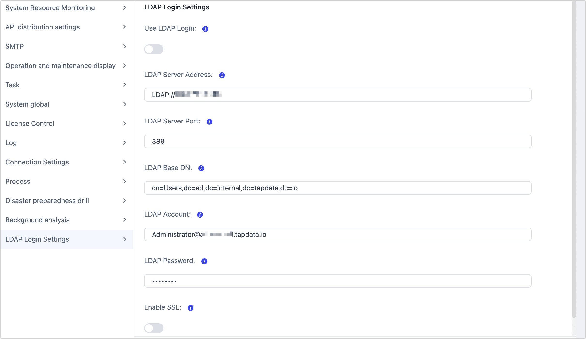

# System Settings
import Content from '../../reuse-content/_enterprise-features.md';

<Content />

The system settings feature is mainly used to configure some parameters of the system, such as logging, SMTP, API distribution, and more.

## Accessing System Settings

In the upper-right corner of the page, click on the  icon, and then click on **System Settings**.

## Log Settings

**Log Level**: In the log settings, you can set the log level. Available log levels include: **error**/**warn**/**info**/**debug**/**trace**. When you select a level, only logs of that level and higher will be printed in the logs.

**Log Filtering Interval (seconds)**: Set the time interval during which the same log will only appear once (effective after 1 minute).

**Log Output Frequency (lines/second)**: Set the average number of events allowed per second in the log settings.

## SMTP Settings

Configure SMTP service settings, including:

- **SMTP Service Account**: Set the SMTP account.
- **SMTP Service Password**: Set the password for the SMTP account.
- **Encryption Method**: Choose the encryption method, supporting SSL and TLS.
- **SMTP Service Host**: Set the host address of the SMTP service.
- **SMTP Service Port**: Set the port number of the SMTP service.
- **Email Sending Address**: Set the email address from which emails will be sent.
- **Email Receiving Addresses**: Enter the email addresses where alert notifications will be sent, separated by commas (,).
- **Email Subject Prefix (Optional)**: You can set a prefix for the email subject to help you quickly identify the source of the emails.
- **SMTP Proxy Service Host (Optional)**: If the email requires access through a proxy, enter the hostname or IP address of the proxy server.
- **SMTP Proxy Service Port (Optional)**: If the email requires access through a proxy, enter the proxy service port.

After configuring the settings, you can view the email templates. You can test the configuration by conducting a connection test.

After a successful connection test, click the Save button to save the SMTP settings.

## API Distribution Settings

Configure API distribution policies, including:

- **The Number of Rows returned by the Default Query:** Set the default number of rows returned by API queries.
- **Maximum Number of  Rows Returned by the Query**: Set the maximum number of rows returned by API queries.
- **Enable API Statistics**: Set whether to enable API statistics.
- **Maximum Number of API Request Cache**: Set the maximum number of cached API requests.
- **API Request Report Frequency** (seconds): Set the frequency of API request reporting.

## Connection Settings

Configure some settings related to connection management, including:

- **MongoDB Load Model Sampling Records** (rows): Set the number of sampling records when loading MongoDB models.
- **Data Source Schema Update Time**: Set the specific time for automatic data source schema updates.
- **Data Source Schema Update Interval** (days): Set the update period for data source schemas in days.
- **Allow the Creation of Duplicate Data Sources**: Set whether to allow the creation of duplicate data sources.

## Operation Display Settings

Operation display settings include:

- **O&M Operation Control URL**
- **Flow Engine Version**
- **TapData Agent Version**

## Global System Settings

Global system settings support the following options:

- **Maximum CPU Usage** (range 0.1 to 1)
- **Maximum Heap Memory Usage** (range 0.1 to 1)
- **License Expiration Reminder**

## Disaster Drill Settings

Disaster drill settings mainly include:

- **Allow Disaster Recovery Exercises**
- **Mongod Path**
- **SSH Username**
- **SSH Port**

## Background Analysis Settings

Background analysis settings mainly set the interval for data quality analysis. You can adjust these settings according to your needs.

## System Resource Monitoring Settings

System resource monitoring settings mainly set the data collection frequency for system resource monitoring. You can adjust these settings according to your needs.

## Process Settings

Process settings are primarily used to set the expiration time for process heartbeats.

- **Process Heartbeat Period Time** (seconds)

## Task Settings

Task settings are mainly used to configure some parameters during task runtime. Supported settings include:

- **Incremental Lag Decision Time** (seconds): Sets the time threshold for determining if a task is lagging.
- **Whether to Add the Creation Time to Target Data Set**: true or false
- **Cache a copy of the current overall data and merge it into the target data set**
- **Cache a copy of the overall data before modification and merge it into the target data set**
- **Whether to transfer task logs to the cloud**
- **Interval time for switching to batch insert mode in incremental mode** (unit: second)
- **Sampling rate**
- **Task load threshold** (percentage)
- **Task load statistics time** (minute)
- **Illegal characters replaced with**
- **Synchronization task heartbeat timeout** (milliseconds)
- **Incremental synchronization task sharing mode**
- **Incremental tasks are forced to use shared mode**
- **Automatically save incremental events**
- **Incremental event save time** (days)
- **Retry Interval** (Second)
- **Maximum Retry Time**(Minute)

## LDAP Login Settings

TapData supports integrating with LDAP (Lightweight Directory Access Protocol) for user login authentication. By integrating LDAP, organizations can centralize user management within existing directory services, enhancing efficiency and security while simplifying administrative processes to ensure data platform security and compliance. The configuration parameters are as follows:

* **Use LDAP Login**: Determines whether LDAP is enabled for user login authentication.
* **LDAP Server Address**: The host address or IP of the LDAP server. TapData will use this address to connect and communicate with the LDAP server.
* **LDAP Server Port**: The port used to establish communication with the LDAP server. The default port for non-encrypted connections is `389`, while SSL-encrypted connections use port `636`.
* **LDAP Base DN**: The starting point for LDAP queries, used to define the user search scope in Active Directory (AD). Multiple groups are supported and can be separated by semicolons (`;`), e.g., `cn=Users,dc=example,dc=com;cn=Test,dc=example,dc=com`. Configuring multiple Base DNs allows for flexible definition of different user groups for authentication, ensuring precise coverage of the search scope.
* **LDAP Account**: The account used to authenticate with the LDAP server, typically an LDAP administrator with query permissions, formatted as a full Distinguished Name (DN), e.g., `administrator@ad.tapdata.io`.
* **LDAP Password**: The password corresponding to the LDAP account, used for authentication and to allow TapData to retrieve user information from the LDAP server.
* **Enable SSL**: Specifies whether to connect to the LDAP server using SSL encryption. If enabled, an SSL certificate file must also be uploaded.

Once the settings are configured, you can click **Test** to verify the correctness of the configuration.
